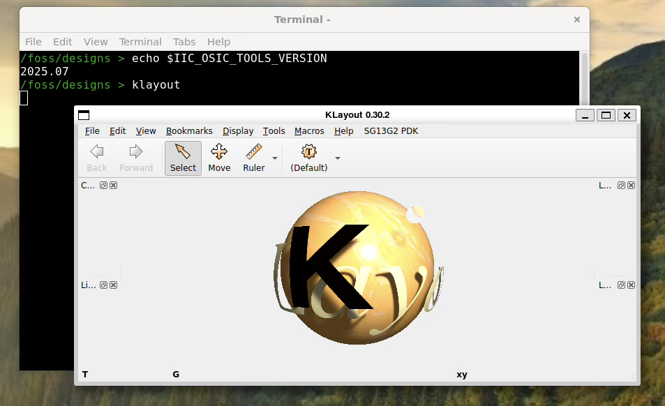

# Windows - Installation and setup

## WSL - Windows Subsystem for Linux

Open a command terminal and run this command

```bash
wsl --status
````

If Windows Subsystem for Linux is not installed, install it:

```bash
wsl --install
````

And update it:

```bash
wsl --update
```

Then reboot the computer.

## Docker

Install the Docker app by following these instructions:
[https://github.com/iic-jku/IIC-OSIC-TOOLS?tab=readme-ov-file#4-quick-launch-for-designers](https://github.com/iic-jku/IIC-OSIC-TOOLS?tab=readme-ov-file#4-quick-launch-for-designers)
After installation, reboot your computer.
After the computer restarts, run the Docker app. You'll need to create an account or link it to an existing Google or Github account.

## Download the IIC-OSIC repository

Download the archive and unzip it:
[https://github.com/iic-jku/IIC-OSIC-TOOLS/archive/refs/tags/2025.07.zip](https://github.com/iic-jku/IIC-OSIC-TOOLS/archive/refs/tags/2025.07.zip)

## Set environment variables

Before starting the Docker container for the first time, we need to set some environment variables.

- DESIGNS is where in your local file system the docker home directory is. You can create a new directory wherever you want in your filesystem. In this example I created a new directory in my home directory called ‘asic’

- **`DOCKER_TAG`** is what exact version of the tools we want to run.

The **`DOCKER_TAG`** should be set to 2025.07. This will ensure that you are using the correct version of the tools.
In the command window, type these commands:

```bash
SET DOCKER_TAG=2025.07
SET DESIGNS="C:<User Path>\asic"
```

## Start the Docker
At this point you should be able to start the Docker container.  The first time can take a few minutes while the container is setup.

First ensure that the Docker app is running. Launch it from the start menu.
Then, in the command window, make sure you're inside the unzipped IIC-OSIC repository and then run this command:

```powershell
.\start_x.bat
```

## Test
Test the Docker container by checking the version and launching KLayout. 

```bash
echo $IIC_OSIC_TOOLS_VERSION 
klayout
```

You should see the version is 2025.07 and KLayout will start with version 0.30.2.


<div style="text-align: center;">
    
</div>


## LibreLane Summary Tool

Inside the Docker container, clone the LibreLane summary tool:
```bash
git clone https://github.com/mattvenn/librelane_summary
```
Create a .designinit file
Inside the Docker container, create a file called .designinit with these contents:

```bash
PDK_ROOT=/foss/pdks
PDK=sky130A
PDKPATH=/foss/pdks/sky130A
STD_CELL_LIBRARY=sky130_fd_sc_hd
SPICE_USERINIT_DIR=/foss/pdks/sky130A/libs.tech/ngspice
KLAYOUT_PATH=/headless/.klayout:/foss/pdks/sky130A/libs.tech/klayout:/foss/pdks/sky130A/libs.tech/klayout/tech
PATH=$PATH:/foss/designs/librelane_summary
```

Then when the container starts, the correct variables will be set automatically.

## Persist the environment
It's important to make sure that **`DOCKER_TAG`** especially is set, otherwise the container might update and you'll get a version of the tools that don't work with the courseware.
To avoid setting DESIGNS and **`DOCKER_TAG`** variables every time you want to use the tools, you can persist them.
Start powershell as adminstrator (right click, run as administrator).
Then type these commands:

```powershell
setx DOCKER_TAG “2025.07” /M
setx DESIGNS “C:<User path>\asic” /M
```

These should then stay set over reboots.

## Quitting and Restarting
Once you close the first terminal window that Docker opens, the container will be stopped. 
When you want to use it again, make sure Docker is running, then run  **`.\start_x.bat`** again. If the container is already running, you can start with this command:

```bash
docker start iic-osic-tools_xserver
```

You can also use the play and stop buttons on the Docker app.


# Linux - Installation and setup


## Git

If you don't have `git` installed, install it like this:

```bash
sudo apt-get install git
```

## Docker
Install docker following these instructions:
[https://github.com/iic-jku/IIC-OSIC-TOOLS?tab=readme-ov-file#4-quick-launch-for-designers](https://github.com/iic-jku/IIC-OSIC-TOOLS?tab=readme-ov-file#4-quick-launch-for-designers)
Make sure to follow the post install instructions to avoid running the tools as root.

## Clone the OSIC tools repo

Open a terminal and run this command:

```bash
 git clone https://github.com/iic-jku/IIC-OSIC-TOOLS.git -b 2025.09
```

## Set environment variables
Before starting the docker for the first time, we need to set some environment variables.

- **`DESIGNS`** is where in your local file system the docker home directory is. You can create a new directory wherever you want in your filesystem. In this example I created a new directory in my home directory called ‘asic’
- **`DOCKER_TAG`** is what exact version of the tools we want to run.

The **`DOCKER_TAG`** should be set to 2025.07. This will ensure that you are using the correct version of the tools.

```bash
export DOCKER_TAG=2025.07
export DESIGNS=~/asic/
```

## LibreLane Summary Tool
Change to your **`DESIGNS`** directory and clone the LibreLane summary tool:

```bash
git clone https://github.com/mattvenn/librelane_summary
```

## Create a .designinit file
In the directory where you set DESIGNS to, create a file called .designinit with these contents:

```bash
PDK_ROOT=/foss/pdks
PDK=sky130A
PDKPATH=/foss/pdks/sky130A
STD_CELL_LIBRARY=sky130_fd_sc_hd
SPICE_USERINIT_DIR=/foss/pdks/sky130A/libs.tech/ngspice
KLAYOUT_PATH=/headless/.klayout:/foss/pdks/sky130A/libs.tech/klayout:/foss/pdks/sky130A/libs.tech/klayout/tech
PATH=$PATH:/foss/designs/librelane_summary
```

Then when the docker starts, the correct variables will be set automatically.


## Start the Docker
At this point you should be able to start the Docker container.  The first time can take a few minutes while the container is setup.

Make sure you're inside the IIC-OSIC-Tools directory you cloned earlier. Then start the container:

```bash
./start_x.sh
```

## Test
Test the docker by checking the version and launching KLayout. 

```bash
echo $IIC_OSIC_TOOLS_VERSION 
klayout
```

You should see the version is 2025.07 and KLayout will start with version 0.30.2.

<div style="text-align: center;">
    
</div>

## Persist the environment
It's important to make sure that **`DOCKER_TAG`** especially is set, otherwise the container might update and you'll get a version of the tools that don't work with the courseware.
To avoid setting DESIGNS and **`DOCKER_TAG`** variables every time you want to use the tools, you can persist them.
Edit your `~/.bashrc` file and add the export lines to the bottom of the file:

```bash
export DOCKER_TAG=2025.07
export DESIGNS=~/work/asic-course/
```

## Quitting and Restarting
Once you close the first terminal window that Docker opens, the container will be stopped. 
When you want to use it again, run `./start_x.sh` again. If the container still exists you can press 's' to start it or 'r' to remove it.


