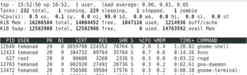
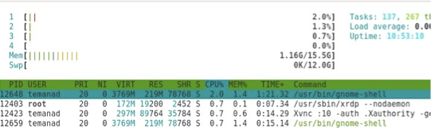

# Introduction to Linux

## What is linux?

- Linux is a family of open-source Unix-like operating systems.
- The Linux kernel was released by Linus Torvalds in 1991.
- Provided under the GNU General Public License.
- Originally developed to provide a Unix experience for personal computers based on x86 Currently ported to more platforms than any other OS.
- Android is based on Linux.
- Linux is usually packaged as a distribution or “Distro” Red Hat, Fedora, Ubunto, CentOS, SUSE, others
- Commonly distributed with windowing system and desktop environment (e.g., GNOME, KDE)

## The Bash Shell

- Your interface into the operating system is the “shell"
  - Allows you to run programs
  - Give input to programs
  - Inspect the output of programs

- The “Bourne Again Shell” (bash) is the most popular Linux shell today.
- We will first open a “terminal”.
- This will provide us with a “prompt”

    ```bash
    /foss/designs > 
    ```

## Hello, World

- Every programming course starts with a **“Hello, World!”**

  - To tell bash to print “Hello, World!”, we’ll use the command echo:

    ```bash
    /foss/designs >  echo 'hello, World!'
    ```

  - **echo** is the name of the program and ‘Hello, World!’ is the argument.
  - We can run other programs, try, for example, **date**.

# Basic elements of Linux

## Paths {.allowframebreaks}

- **How does the shell know how to find the `date` or `echo` programs?**
  - It searches through a *list of locations on the file server*.
- **Where is this list stored?**
  - In an *environment variable* called `PATH`.
- **To dereference a variable, we will use the `$` character:**

    ```bash
    /foss/designs > echo $PATH
    ```

  - We got a list of locations on the server, which are used to *search for programs.*

- **But where did it find the `echo` and `date` programs?**

    ```bash
    /foss/designs > which date
    ```

  - We see that these are executable files stored in the **`/bin (=binaries)`** folder
    - Alternatively, we could have run:

    ```bash
    /foss/designs > /bin/echo 'Hello, World!'
    ```

## Navigation in the Shell {.allowframebreaks}

- **So we saw that there are “locations” in the Linux environment**
    - `/` is the `“root”` of the filesystem, under which all directories and files lie.
    - `~` is your `“home”` directory, but this is an alias.
    - To see what the real path to your home directory is:

    ```bash
    /foss/designs > pwd
    ```

    ```bash
    /foss/designs > echo $HOME
    ```

    - `pwd` is short for `“print working directory”` – that’s “where we are” now

- **We can navigate through directories with `cd` (change directory)**  

    ```bash
    /foss/designs > cd ..
    /foss/designs > ./juancho
    ```

- **`.` is the `“current”` directory, while `..` is the `“parent”` directory**

## Directory Contents {.allowframebreaks}

- To see what files and directories are in the current folder, use the `ls` command

    ```bash
    /foss/designs > ls
    /foss/designs > ls ~/Desktop
    ```

- Add flags and options (usually starting with a `-`) to modify a command’s behavior

    ```bash
    /foss/designs > ls -l
    ```

- To get a list of options use the `-h` or `--help` flag or open the `man` page

    ```bash
    /foss/designs > ls --help
    /foss/designs > man ls
    ```

- Use `“globbing”` to match many strings
    - `?` Matches any single character
        ```bash
        /foss/designs > ls myfile?.txt
        ```
- `*` matches any one or more characters
     ```bash
    /foss/designs > ls myfile*
    ```

## Dot Files 

- Many programs are configured using plain-text files known as `dotfiles*`
    - Filenames that start with a `.` are hidden by `ls` unless the `-a` flag is used.

       ```bash
       /foss/designs > ls -a
       ``` 
 
- Some important dotfiles are:
    - `~/.bashrc`, `~/.bash_profile`: Configure settings for your Bash shell.
    - `~/.gitconfig`: Configure git.
    - `~/.vimrc`: Configure VIM.
    - `~/.ssh/config`: Configures secure shell (`ssh`).

# Useful Linux interactions

## File Permissions 

- Files are created with default permissions (read/write/execute access)
  - Create an empty file with the `touch` command

    ```bash
    /foss/designs > touch myfile
    ```

  - Show information about the file with `ls -l`:

    { width=80% }

- To change file permissions, use the `chmod` command:
  - Make the file executable: `chmod +x myfile`
  - Make the file writeable by other group members: `chmod g+w myfile`
  - Use a bit mask to make the file readable/writeable by all: `chmod 666 myfile`

## Redirection {.allowframebreaks}

- By default the input/output of your program is the terminal:
  - Input is from your keyboard
  - Output is to the screen
- But you can “redirect” the input/output streams using `< file` and `> file`:
  - Print `“hello”` to a file instead of the screen
        ```bash
        /foss/designs > echo "Hello" > myfile
        ```

  - To see that it worked, use the `cat` command:

    ```bash
    /foss/designs > cat myfile
    ```

  - Now redirect our file to be used as the input to the `cat` command and write the output into a new file:

    ```bash
    /foss/designs > cat < myfile > myfile2
    ```

  - Append `“world!”` to the file

    ```bash
    /foss/designs > echo "world!" >> myfile2
    ```

## Other basic commands {.allowframebreaks}

- Create a directory

    ```bash
    /foss/designs > mkdir mydir
    ```

- Remove a directory

    ```bash
    /foss/designs > rmdir mydir
    /foss/designs > rm -r mydir #this is also a remove directory
    ```

- Copy a file

    ```bash
    /foss/designs > cp myfile myfilecopy
    ```

- Rename (move) a file

    ```bash
    /foss/designs > mv myfilecopy myfile2
    ```

- Delete a file

    ```bash
    /foss/designs > rm myfile2
    ```

- Finding a file

    ```bash
    /foss/designs > find . -name myfile
    /foss/designs > find . -name myfile -exec rm {} \;
    ```

- Seeing command history

    ```bash
    /foss/designs > history
    ```

- Viewing files

    ```bash
    /foss/designs > cat myfile
    /foss/designs > more myfile
    /foss/designs > less myfile
    /foss/designs > vim myfile
    /foss/designs > nano myfile
    ```

- Show the beginning or end of a file

    ```bash
    /foss/designs > head myfile
    /foss/designs > tail myfile
    ```

- Compare files

    ```bash
    /foss/designs > diff myfile myfile2
    ```

## Pipes

- The pipe (`|`) operator lets you “chain” programs such the output of one is the input of another:

    ```bash
    /foss/designs > ls -l | grep my*
    ```

  - In this example, we took the output of the `ls –l` command and sent it to the `grep` command.

  - **`grep`** is an extremely powerful shell command that lets you select lines of text in a file that match a given string. In this case, if the line of text contains any word starting with `“my”` (e.g., `myfile`, `myfile2`) then they will be printed out.
- You can get the output of a command as a variable using `$(CMD)`

    ```bash
    /foss/designs > echo "The current date is $(date)"
    ```

## Aliases and symbolic links

- Instead of writing out a whole (complex) command, use an alias with the syntax `alias alias_name="command_to_alias arg1 arg2"`

    ```bash
    /foss/designs > alias ll="ls -ltrh"
    /foss/designs > alias gv="grep -V"
    /foss/designs > alias grl="grep --color --line-number"
    ```

- To see a list of all configured aliases, type alias.

    ```bash
    /foss/designs > alias | less
    ```

- And you can create a link (shortcut) to a file or directory for quick access:

    ```bash
    /foss/designs > ln -s myfile mylink
    ```

## Writing an executable program {.allowframebreaks}

- Let’s start by writing an executable “Hello, World!” program:
  - Create a file that prints out “Hello, World!”:

    ```bash
    /foss/designs > echo 'echo "Hello, World!"' > hello
    ```

- Now try to execute the file:
  - Ah, we need to make it executable… `chmod u+x hello`

- But how can we tell it to use `Bash` (rather than another shell) to run our program?
  - We’ll use the very popular `VIM` text editor:

    ```bash
    /foss/designs > vim hello
    ```

  - Press “i“ to go into “insert” mode.
  - Now type:

    ```bash
    #!/bin/bash
    echo "hello"
    ```

  - Hit esc to exit “insert” mode.
  - To save and exit, type :wq

## Variables {.allowframebreaks}

- The shell, like other programming languages, has variables.
- In `Bash`, we just write `var=value` (no spaces!) to define a variable

    ```bash
    /foss/designs > foo=bar
    ```

  - Pay attention that using quotations (`“”`) will substitute values, while `‘’` will not:

    ```bash
    /foss/designs > echo "$foo"
    /foss/designs > echo '$foo'
    ```

- Variables are local to the shell, so they aren’t known to programs

  - Instead, you can use environment variables, such as `$PATH`, `$HOME`.  
  - You can access environment variables from within programs.  
  - To see a list of environment variables, type `env`.

    ```bash
    /foss/designs > env | more
    ```

  - To define a new environment variable, type `export`:

    ```bash
    /foss/designs > export charlie=brown
    ```

# Advanced utilities

## Shell Scripting 

- Bash supports regular control flow commands, such as if, case, while, for.
- In addition, you can write scripts, and pass arguments to them:
  - $0 – name of the script
  - $1-$9 – arguments
  - $@ all the arguments
  - $# number of arguments
  - $? – exit status of previous

--- 

- Here and small bash script example.

    > Be sure the file is saved as **`bash_script.sh`**

    ```bash
    #!/bin/bash
    echo "Running program $0 with $# arguments"
    for file in "$@"; do
        grep foobar "$file" > /dev/null 2> /dev/null
        # If pattern not found, grep has exit status 1
        # Redirect STDOUT and STDERR to a null register
        if [[ $? -ne 0 ]]; then
            # If grep exited with status 1
            echo "Adding foobar to $file"
            echo "# foobar" >> "$file"
        fi
    done
    ```

---

- The previous script can be executed like this:

    ```sh
    /foss/designs > ./bash_script.sh
    ```

- You can also call a script written in another language:

    ```bash
    #!/bin/python
    print ("hello, world!")
    ```

## Compressing and Uncompressing

- To compress a file in Linux, you can use the `zip` command:

    ```bash
    /foss/designs > zip myfile.zip myfile.txt
    ```

- To uncompress a file:

    ```bash
    /foss/designs > unzip myfile.zip 
    ```

- But in Linux we often compress a whole folder using `tar`:

    ```bash
    /foss/designs > tar -czvf name-of-archive.tar.gz \
    /path/to/directory-or-file
    ```

- Then extract the archive:

    ```bash
    /foss/designs > tar -xzvf archive.tar.gz
    ```

## Jobs control {.allowframebreaks}

- Sometimes you need to send a software interrupt to your process, while it is still running (or possibly stuck…)

    - `Ctrl-c`: Sends a `SIGINT` signal to the process, usually killing it.
    - `Ctrl-\`: Sends a `SIGQUIT` signal to the process, killing it.
    - `Ctrl-z`: Sends a `SIGSTP` signal that pauses a process.
        - To continue a process after pausing it, type the `fg` command.
        - To continue running the process in the background, type the `bg` command.
    - To start a command running in the background, use `&`. 
        
        ```bash
        /foss/designs firefox &
        ```

- To see all unfinished jobs (run from this terminal) type `jobs`.

    - The jobs are listed as `[n]`. You can control the specific job with `%n`.

    - For example, move the first process to the foreground using `fg %1`.

    - Kill the second process using `kill %2`.

    - If you have some stubborn GUI that won’t die, use `xkill`.

- To see all running processes, use the `ps` command.
    - `ps` will list all process running in this terminal

    - `ps -u username` will list all the processes associated with a specific user

    - `ps -A` will show all running processes

- For a graphical representation, use the `top` or `htop` commands
  - Sort jobs in `top` by memory consumption by pressing shift-M.
  - Kill a job from `top` by pressing k and then entering the PID.

    { width=70% }
    { width=70% }

# And some cool commands to finish

##

- Sort words in a file with the `sort` command:

    ```bash
    /foss/designs > sort names.txt
    /foss/designs > sort -r names.txt
    ```

- Get rid of duplicates with the `uniq` command:

    ```bash
    /foss/designs > uniq names.txt
    /foss/designs > sort names.txt | uniq
    ```

- Count the number of words in a file:

    ```bash
    /foss/designs > wc names.txt
    /foss/designs > sort names.txt | uniq | wc
    ```
