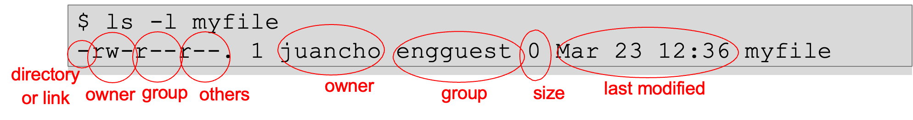

# Linux Tutorial

## Linux
- Linux is a family of open-source Unix-like operating systems.
- The Linux kernel was released by Linus Torvalds in 1991.
- Provided under the GNU General Public License.
- Originally developed to provide a Unix experience for personal computers based on x86 Currently ported to more platforms than any other OS.
- Android is based on Linux.
- Linux is usually packaged as a distribution or “Distro” Red Hat, Fedora, Ubunto, CentOS, SUSE, others
- Commonly distributed with windowing system and 	desktop environment (e.g., GNOME, KDE)

## The Bash Shell

- Your interface into the operating system is the “shell
    - Allows you to run programs
    - Give input to programs
    - Inspect the output of programs

- The “Bourne Again Shell” (bash) is the most popular Linux shell today.
- We will first open a “terminal”.
- This will provide us with a “prompt”

    ```bash
    /foss/designs > 
    ```

## Hello, World!
- Every programming course starts with a “Hello, World!”
    - To tell bash to print “Hello, World!”, we’ll use the command echo:

        ```bash
        /foss/designs >  echo 'hello, World!'
        ```

    - echo is the name of the program and ‘Hello, World!’ is the argument.
    - We can run other programs, try, for example, date:

## Paths

- **How does the shell know how to find the `date` or `echo` programs?**
    - It searches through a *list of locations on the file server*.
- **Where is this list stored?**
    - In an *environment variable* called `PATH`.
- **To dereference a variable, we will use the `$` character:**

    ```bash
    /foss/designs > echo $PATH
    ```

    - We got a list of locations on the server, which are used to *search for programs.*
- **But where did it find the `echo` and `date` programs?**

    ```bash
    /foss/designs > which date
    ```
    - We see that these are executable files stored in the **`/bin (=binaries)`** folder
    - Alternatively, we could have run: 
        ```bash
        /foss/designs > /bin/echo 'Hello, World!'
        ```

## Navigation in the Shell

- **So we saw that there are “locations” in the Linux environment**
    - `/` is the `“root”` of the filesystem, under which all directories and files lie.
    - `~` is your `“home”` directory, but this is an alias.
    - To see what the real path to your home directory is:

    ```bash
    /foss/designs > pwd
    ```

    ```bash
    /foss/designs > echo $HOME
    ```

    - `pwd` is short for `“print working directory”` – that’s “where we are” now

- **We can navigate through directories with `cd` (change directory)**  

    ```bash
    /foss/designs > cd ..
    /foss/designs > ./juancho
    ```

- **`.` is the `“current”` directory, while `..` is the `“parent”` directory**

## Directory Contents
- To see what files and directories are in the current folder, use the `ls` command

    ```bash
    /foss/designs > ls
    /foss/designs > ls ~/Desktop
    ```

- Add flags and options (usually starting with a `-`) to modify a command’s behavior

    ```bash
    /foss/designs > ls -l
    ```

- To get a list of options use the `-h` or `--help` flag or open the `man` page

    ```bash
    /foss/designs > ls --help
    /foss/designs > man ls
    ```

- Use `“globbing”` to match many strings
    - `?` Matches any single character
        ```bash
        /foss/designs > ls myfile?.txt
        ```
- `*` matches any one or more characters
     ```bash
    /foss/designs > ls myfile*
    ```

## Dot Files
- Many programs are configured using plain-text files known as `dotfiles*`
    - Filenames that start with a `.` are hidden by `ls` unless the `-a` flag is used.

       ```bash
       /foss/designs > ls -a
       ``` 
 
- Some important dotfiles are:
    - `~/.bashrc`, `~/.bash_profile`: Configure settings for your Bash shell.
    - `~/.gitconfig`: Configure git.
    - `~/.vimrc`: Configure VIM.
    - `~/.ssh/config`: Configures secure shell (`ssh`).

## File Permissions

- Files are created with default permissions (read/write/execute access)
    - Create an empty file with the `touch` command
        ```bash
        /foss/designs > touch myfile
        ```

    - Show information about the file with `ls -l`:

<div style="text-align: center;">
    
</div>

- To change file permissions, use the `chmod` command:
    - Make the file executable: `chmod +x myfile`
    - Make the file writeable by other group members: `chmod g+w myfile`
    - Use a bit mask to make the file readable/writeable by all: `chmod 666 myfile`

## Redirection
- By default the input/output of your program is the terminal:
    - Input is from your keyboard
    - Output is to the screen
- But you can “redirect” the input/output streams using `< file` and `> file`:

    - Print `“hello”` to a file instead of the screen
        ```bash
        /foss/designs > echo "Hello" > myfile
        ```

    - To see that it worked, use the `cat` command:

        ```bash
        /foss/designs > cat myfile
        ```

    - Now redirect our file to be used as the input to the `cat` command and write the output into a new file:

        ```bash
        /foss/designs > cat < myfile > myfile2
        ```

    - Append `“world!”` to the file

        ```bash
        /foss/designs > echo "world!" >> myfile2
        ```

## Other basic commands

- Create a directory
    ```bash
    /foss/designs > mkdir mydir
    ```

- Remove a directory
    ```bash
    /foss/designs > rmdir mydir
    /foss/designs > rm -r mydir #this is also a remove directory
    ```

- Copy a file
    ```bash
    /foss/designs > cp myfile myfilecopy
    ```

- Rename (move) a file
    ```bash
    /foss/designs > mv myfilecopy myfile2
    ```

- Delete a file
    ```bash
    /foss/designs > rm myfile2
    ```

- Finding a file
    ```bash
    /foss/designs > find . -name myfile
    /foss/designs > find . -name myfile -exec rm {} \;
    ```

- Seeing command history
    ```bash
    /foss/designs > history
    ```


- Viewing files
    ```bash
    /foss/designs > cat myfile
    /foss/designs > more myfile
    /foss/designs > less myfile
    /foss/designs > vim myfile
    /foss/designs > nano myfile
    ```

- Show the beginning or end of a file
    ```bash
    /foss/designs > head myfile
    /foss/designs > tail myfile
    ```

- Compare files
    ```bash
    /foss/designs > diff myfile myfile2
    ```

## Pipes
- The pipe (`|`) operator lets you “chain” programs such the output of one is the input of another:
    ```bash
    /foss/designs > ls -l | grep my*
    ```

    - In this example, we took the output of the `ls –l` command and sent it to the `grep` command.

    - `grep` is an extremely powerful shell command that lets you select lines of text in a file that match a given string. In this case, if the line of text contains any word starting with `“my”` (e.g., `myfile`, `myfile2`) then they will be printed out.
- You can get the output of a command as a variable using `$(CMD)`

     ```bash
    /foss/designs > echo "The current date is $(date)"
    ```

