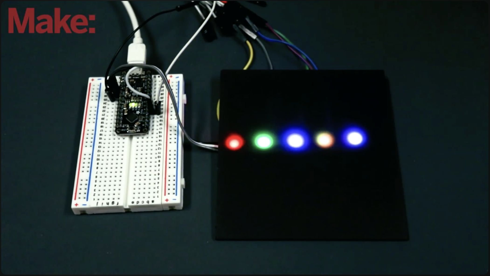

# Verilog tutorial

This tutorial introduces the basics of Verilog HDL for describing digital circuits. In this example we are going to implement a simple RGB color mixer using verilog. 

<div style="text-align: center;">
    
</div>

---

## RGB mixer example

Before actually write any verilog code for our design, first we need to design the general architecture based on some specifications. An RGB mixer is a circuit that generates tree digital signals to control the brighness of three LEDs (i.e., RED, GREEN, and BLUE) such that the mix of all LEDs intensity create any visible color. In this link [link](https://www.youtube.com/watch?v=gA4Q2K62ips) you can find an interesting explanation about how an RGB LED work. 

<div style="text-align: center;">
    
</div>

# Architectural Design

### I/O interface design

- The brigness of each LED can be controlled via a PWM (Pulse Widht Modulation), enabling variations of light intensity on each LED which then creates different colors. 

- The following figure ilustrates the I/O interface of the circuit we are going to design. 


                              _______________               
                             |               |          
                clk--------->|               |--->PWM0      
                rst_n------->|       RGB     |              
                inc--------->|      Mixer    |--->PWM1      
                dec--------->|               |              
                led[1:0]---->|               |--->PWM2      
                             |_______________|              


---

### Ports description

| **Port** | **Direction** | **Descriptiom** |
|------|-----------|-------------|
|**clk**|input|Clock signal|
|**rst_n**|input|Async reset|
|**inc**|input|Increase the Led brightness|
|**dec**|input|Decrease the Led brightness|
|**led[1:0]**|input|LED selection|
|**PWM0**|output|PWM for RED LED|
|**PWM1**|output|PWM for GREEN LED|
|**PWM2**|output|PWM for BLUE LED|

- The `led[1:0]` is used to select the LED color to be configured.

- The `inc` and `dec` ports are connected to push buttons. The `inc` input increases the brightness while the `dec` input decreases the brightness of the selected LED.

---

The following figure depicts the general architecture for the PWM mixer proposed in this tutorial. The necesary modules are a PWM generator, an Up/Down counter to control the birghtness of each LED. Also, each push button for `inc` and `dec` it is necesary to implement a `debounce`and `edge-detector` modules to filter the mechanical noise produced by the push buttons. 

Finally, a 2:4 decoder is used to select a single PWM channel to be configured.

<div style="text-align: center;">
    
</div>


## PWM Core Design

The generation of a PWM signal requires a baseline Sawtooth waveform as shown in the next figure. This signal determines the period of the PWM signal. 

The final PWM signal is generated by setting a threshold value use to be compare with the sawtooth wave. 


<div style="text-align: center;">
    
</div>
<div style="text-align: center;">
    
</div>

---

### PWM generation {.alert}

The operation is quite simple; when the sawtooth wave is below the threshold (e.g., Red line) the output takes a fixed high digital value. On the other hand, when the sawtooth wave goes higer than the threshold line, the output signal goes low. In the end, moving the threshold upwards the pulse widht augments while droping the treshold dowm causes a reduction on the Pulse width of the output signal. 

<div style="text-align: center;">
    
</div>
<div style="text-align: center;">
    
</div>

---

### PWM generated digitally: Sawtooth generation

<div style="text-align: center;">
    
</div> 

The PWM generation can be implemented digitally. The Sawtooth can be generated using a up counter. The Frequency of the generated waveform $F_{pwm}$ can be ddetermined by the clock reference period times the number of clock cycles elapsed (i.e., PERIOD_VAL). 

### Note {.alert}

- The following expressions describe the uperation of the PWM generation circuit.

$\frac{1}{F_{pwm}}=\frac{1}{F_{clk}}\times NumClockCycles$

$NumClockCycles=\frac{F_{clk}}{F_{pwm}}=PERIOD\_VAL$

---

### PWM generated digitally: PWM generation

<div style="text-align: center;">
    
</div>

Once implemented the sawtooth generator, the PWM signal is simply generated by comparing the value of the counter and a threshold value (i.e., pwm_ref). This signal can be controlled externally by another component in the system. 

Finally, the comparison output is regitered by a flip-flop in order to remove any possible glitch generation comming from the combinational logic. 

## UP/Down counter: Design

<div style="text-align: center;">
    
</div>


This counter helps to set the threshold values used to control the PWM generation. The counter changes up or down only when the global enable signal `enable` is active, otherwishe the counter remians unchaged regardless the states in `inc` and `dec`. During the operation, the `inc` and `dec` inputs must be a single pulse. 


## Edge detector Design

::: {.columns}

::: {.column width="50%"}

<div style="text-align: center;">
    
</div>

:::

::: {.column width="40%"}

<div style="text-align: center;">
    
</div>

:::

:::


This circuit generarates a single pulse every falling edge detected at the input signal, as required by the up/down counter. The figures show the waveform and the circuit implemementation for the edge detector. It is worth to mention that in this example we selected falling-edge detection, as most of the push buttons in most of the development boards use the pull-up configuration, chaning from `High` to `Low` when pushing the button. 


## Debounce circuit Design

### 
The debounce circuit is fundamental when dealing with mechanical user interfaces (i.e., push buttons, slide switches etc.). In fact, these types of devices are not able of providing clean digital signals; instead, when pressed a mechanical effect produces certain oscilations on the electrical signals. Such oscilations, when not filtered out, can produce unintended, or wrong behaviours on our digital systems. For example, a counter connected to a push button can change more than once on a single push. 

---

<div style="text-align: center;">
    
</div>

Deboucing the input digital signals require to ensure that they are stable during at least 100ms. This can be achieved using the following circuit design. In the first place a counter with periodical reboot can be used as `strobe` generator, enabling the capture of the input at certain samplig frequency. The every sampled value is pushed into a SIPO (Serial Input Parallel Output) register. The content in the SIPO register can be used to determine whether the input pin shows an stable value or not. 


# RGB Mixer: Verilog implementation 

## RGB mixer in Verilog

### PWM Generator 

The full code can be found in [./src/PWM.v](./src/PWM.v)

```verilog
// PWM core description
`timescale 1ns / 1ps

module PWM #(parameter CLK_FREQ=50000000, parameter PWM_FREQ=10000, parameter PERIOD_VAL=CLK_FREQ/PWM_FREQ)
(clk, rst_n, pwm_ref, pwm);
input clk;
input rst_n;
input [$clog2(PERIOD_VAL)-1:0] pwm_ref;
output pwm;


reg [$clog2(PERIOD_VAL)-1:0] counter;
reg pwm_reg;
reg [$clog2(PERIOD_VAL)-1:0] pwm_ref_reg;


always @(posedge clk, negedge rst_n) begin
    if (!rst_n) begin
        counter <= 0;
    end else begin
        if ((counter==PERIOD_VAL)) begin
            counter <= 0;
            pwm_ref_reg <= pwm_ref;
        end else begin
            counter <= counter + 1;
        end 
    end 
end

always @(posedge clk, negedge rst_n) begin
    if (!rst_n) begin
        pwm_reg <= 0;
    end else begin
        if (counter<pwm_ref_reg) begin
            pwm_reg <= 1'b1;
        end else begin
            pwm_reg <= 1'b0;
        end 
    end 
end 

assign pwm = pwm_reg;
endmodule
```

---

### Testbench for PWM.v 

The full testbench code can be found in [./tb/tb_PWM.v](./tb/tb_PWM.v)
    
```verilog
// PWM TestBench description
`timescale 1ns / 1ps
`define CLK_FREQ 50000000
`define CLK_PWM 10000
`define PERIOD_VAL  `CLK_FREQ/`CLK_PWM

module tb_PWM;

reg s_clk, s_rst_n;
reg [$clog2(`PERIOD_VAL)-1:0] s_pwm_ref;
wire s_pwm;

PWM dut(
.clk(s_clk),
.rst_n(s_rst_n),
.pwm_ref(s_pwm_ref),
.pwm(s_pwm)
);


always begin
    #10 s_clk = ~s_clk;
end


initial
begin
    $dumpfile("tb_PWM.vcd");
    $dumpvars;
end

initial begin
s_clk=0;
s_rst_n=0;
s_pwm_ref=100;
#80 s_rst_n=1;
repeat (20000) @(negedge s_clk);
s_pwm_ref=500;
repeat (20000) @(negedge s_clk);
s_pwm_ref=1000;
repeat (20000) @(negedge s_clk);
s_pwm_ref=1500;
repeat (20000) @(negedge s_clk);
s_pwm_ref=2000;
repeat (20000) @(negedge s_clk);
s_pwm_ref=2500;
repeat (20000) @(negedge s_clk);
s_pwm_ref=3000;
repeat (20000) @(negedge s_clk);
s_pwm_ref=4000;
repeat (20000) @(negedge s_clk);
s_pwm_ref=3000;
repeat (20000) @(negedge s_clk);
s_pwm_ref=2500;
repeat (20000) @(negedge s_clk);
s_pwm_ref=2000;
repeat (20000) @(negedge s_clk);
s_pwm_ref=1000;
repeat (20000) @(negedge s_clk);
s_pwm_ref=100;
repeat (20000) @(negedge s_clk);
$finish;
end

endmodule
```

---

### PWM simulation

- The following commands are used to simulate the verilog design using icarus Verilog.
    
    ```bash
    iverilog -o tb_PWM.vvp src/PWM.v tb/tb_PWM.v 
    vvp tb_PWM.vvp
    gtkwave tb_PWM.vcd
    ```

- Alternativelly, using the following commands you can use `Verilator` to simulate the verilog design.

    ```bash
    verilator --trace --timing --binary -Wno-moddup -Wno-fatal PWM.v tb_PWM.v -top-module tb_PWM
    ./obj_dir/Vtb_PWM
    gtkwave tb_PWM.vcd
    ```


## Up/Down counter in Verilog

### 

The full code can be found in [./src/up_down_counter.v](./src/up_down_counter.v)

```verilog
// Up/Down counter core description
`timescale 1ns / 1ps

module up_down_counter(clk, rst_n, enable, inc, dec, pwm_ref);
input clk;
input rst_n;
input enable;
input inc;
input dec;
output [7:0] pwm_ref;


wire up_ndown;
wire en;

reg [7:0] counter;

assign en=enable&(inc|dec);
assign up_ndown=inc;

always @(posedge clk, negedge rst_n) begin
    if (!rst_n) begin
        counter<=0;
    end else begin
        if (en==1'b1) begin
            if (up_ndown==1'b1) begin
                counter<=counter+1;
            end else begin
                counter<=counter-1;
            end
        end
    end 
end

assign pwm_ref=counter;

endmodule
```

---

### Testbench for Up/Down counter

The full testbench code can be found in [./tb/tb_up_down_counter.v](./tb/tb_up_down_counter.v)


```verilog
// Up/Down counter core description
`timescale 1ns / 1ps
`define CLK_FREQ 50000000
`define CLK_PWM 10000
`define PERIOD_VAL  `CLK_FREQ/`CLK_PWM

module tb_up_down_counter;

task automatic assert_equal(input [31:0] actual, input [31:0] expected);
    if(actual == expected) $display("Assertion passed: Expected %d, Actual %d.", expected, actual);
    else $error("Assertion failed: Expected %d, Actual %d.", expected, actual);
endtask
    

reg s_clk;
reg s_rst_n;
reg s_enable;
reg s_inc;
reg s_dec;
wire [$clog2(`PERIOD_VAL)-1:0] pwm_ref;

reg up;
reg down;

up_down_counter UUT (
    .clk(s_clk),
    .rst_n(s_rst_n),
    .enable(s_enable),
    .inc(s_inc),
    .dec(s_dec),
    .pwm_ref(pwm_ref)
);

// Clock generation
always #10 s_clk = ~s_clk;

always begin
    if (down==1'b1) begin
        s_dec = 1; // Start decrementing
        @(negedge s_clk);
        s_dec = 0; 
        repeat(20) @(negedge s_clk);
    end else begin
        s_dec = 0; // Start decrementing
        @(negedge s_clk);
        s_dec = 0; 
        repeat(20) @(negedge s_clk);
    end

end

always begin
    if (up==1'b1)begin
        s_inc = 1; // Start incrementing
        @(negedge s_clk);
        s_inc = 0; 
        repeat(20) @(negedge s_clk);
    end else begin
        s_inc = 0;
        @(negedge s_clk);
        s_inc = 0; 
        repeat(20) @(negedge s_clk);
    end

end

initial begin
    $dumpfile("tb_up_down_counter.vcd");
    $dumpvars;
end

initial begin
    // Initialize signals
    up=0;
    down=0;
    s_clk = 0;
    s_rst_n = 0;
    s_enable = 0;
    s_inc = 0;
    s_dec = 0;

    // Release reset
    #25;
    s_rst_n = 1;
    up=1;
    down=0;
    s_enable = 1;

    repeat(256) begin
        wait(s_inc==1'b1 || s_dec==1'b1);
        @(posedge s_clk);
        wait(s_inc==1'b0 && s_dec==1'b0);
    end
    assert_equal(pwm_ref, 256);
    
    s_enable = 0;
    repeat(256) begin
        wait(s_inc==1'b1 || s_dec==1'b1);
        @(posedge s_clk);
        wait(s_inc==1'b0 && s_dec==1'b0);
    end
    assert_equal(pwm_ref, 256);
    up=0;
    down=1;
    s_enable = 1;
    repeat(256) begin
        wait(s_inc==1'b1 || s_dec==1'b1);
        @(posedge s_clk);
        wait(s_inc==1'b0 && s_dec==1'b0);
    end
    assert_equal(pwm_ref, 0);
    s_enable = 0;
    repeat(256) begin
        wait(s_inc==1'b1 || s_dec==1'b1);
        @(posedge s_clk);
        wait(s_inc==1'b0 && s_dec==1'b0);
    end
    assert_equal(pwm_ref, 0);
    up=1;
    down=1;
    s_enable = 1;
    repeat(256) begin
        wait(s_inc==1'b1 || s_dec==1'b1);
        @(posedge s_clk);
        wait(s_inc==1'b0 && s_dec==1'b0);
    end
    assert_equal(pwm_ref, 256);
    s_enable = 0;
    repeat(256) begin
        wait(s_inc==1'b1 || s_dec==1'b1);
        @(posedge s_clk);
        wait(s_inc==1'b0 && s_dec==1'b0);
    end
    assert_equal(pwm_ref, 256);
    up=0;
    down=0;
    s_enable = 1;
    repeat(1000) @(negedge s_clk);
    assert_equal(pwm_ref, 256);
    s_enable = 0;
    repeat(1000) @(negedge s_clk);
    assert_equal(pwm_ref, 256);
    s_enable = 1;
    repeat(1000) @(negedge s_clk);
    assert_equal(pwm_ref, 256);
    s_enable = 0;
    repeat(1000) @(negedge s_clk);
    assert_equal(pwm_ref, 256);
    $finish; // End simulation
end 

endmodule
```

---

### Up/Down counter simulation

- The following commands are used to simulate the verilog design using icarus Verilog.

    ```bash
    iverilog -o tb_up_down_counter.vvp src/tb_up_down_counter.v src/up_down_counter.v 
    vvp tb_up_down_counter.vvp
    gtkwave tb_up_down_counter.vcd
    ```

- Alternativelly, using the following commands you can use `Verilator` to simulate the verilog design.

    ```bash
    verilator --trace --timing --binary -Wno-moddup -Wno-fatal src/tb_up_down_counter.v src/up_down_counter.v \
    -top-module tb_up_down_counter
    ./obj_dir/Vtb_up_down_counter
    gtkwave tb_up_down_counter.vcd
    ```

---

## Edge detector in Verilog

### Edge detector core

The full code can be found in [./src/edge_detector.v](./src/edge_detector.v)

Here the Verilog code that describes the edge detector circuit.

```verilog
`timescale 1ns / 1ps

module edge_detector (
    clk,
    rst_n,
    input_signal,
    edge_pulse
);

input clk;
input rst_n;
input input_signal;
output edge_pulse;

reg input_signal_dly;
wire edge_pulse;

always @(posedge clk or negedge rst_n) begin
    if (!rst_n) begin
        input_signal_dly <= 1'b0;
    end else begin
        input_signal_dly <= input_signal;
    end
end

assign edge_pulse = (~input_signal & input_signal_dly);

endmodule
```

---

### Edge detector TestBench

The full code can be found in [./tb/tb_edge_detector.v](./tb/tb_edge_detector.v)

Here the Testbench that checks the correct operation of the edge etector circuit.

```verilog
`timescale 1ns / 1ps

module tb_edge_detector;

task automatic assert_equal(input [31:0] actual, input [31:0] expected);
    if(actual == expected) $display("Assertion passed: Expected %d, Actual %d.", expected, actual);
    else $error("Assertion failed: Expected %d, Actual %d.", expected, actual);
endtask

reg s_clk, s_rst_n;
reg s_input_signal;
wire s_edge_pulse;

edge_detector dut(
.clk(s_clk),
.rst_n(s_rst_n),
.input_signal(s_input_signal),
.edge_pulse(s_edge_pulse)
);

always begin
    #10 s_clk = ~s_clk;
end

initial
begin
    $dumpfile("tb_edge_detector.vcd");
    $dumpvars;
end

initial begin
s_clk=0;
s_rst_n=0;
s_input_signal=0;
#80 s_rst_n=1;

repeat(10) begin
    repeat(100) @(posedge s_clk);
    #1 s_input_signal = 1; // small delay to avoid race condition with clk edge 
    @(negedge s_clk);
    assert_equal(s_edge_pulse, 0);

    repeat(100) @(posedge s_clk);
    #1 s_input_signal = 0; // small delay to avoid race condition with clk edge 
    @(negedge s_clk);
    assert_equal(s_edge_pulse, 1);
end
$finish;
end

endmodule
```

---

### Edge detector simulation


The simulation can be executed either using icarus verilog or verilator as shown in the following commands.

```bash
# Icarus Verilog simulation
iverilog -o edge.vvp src/edge_detector.v tb/tb_edge_detector.v 
./edge.vvp
gtkwave tb_edge_detector.vcd  
```

```bash
# Verilator Simulation
verilator --trace --timing --binary -Wno-moddup -Wno-fatal  src/edge_detector.v tb/tb_edge_detector.v \
-top-module tb_edge_detector
./obj_dir/Vtb_edge_detector
gtkwave tb_edge_detector.vcd
```

---

## Debounce core in verilog

### Debounce circuit design

The following piece of verilog code describes the debounce circuit used to remove the mechanical noise of theinput sources. The DEBOUNCE_TIME has to be configured according to the real clock frequency, In this example we assumed 500Hz of input frequency and 80Hz of debounced frequency. 

The full code can be found in [./src/debounce.v](./src/debounce.v)

```verilog
`timescale 1ns / 1ps

module debounce #(
    parameter CLK_FREQ=50000000,
    parameter DEBOUNCE_FREQ=10
)
(
    clk,
    rst_n,
    input_signal,
    clean_signal
);

input clk;
input rst_n;
input input_signal;
output clean_signal;

parameter DEBOUNCE_TIME=CLK_FREQ/(8*DEBOUNCE_FREQ);
reg [31:0] counter;
reg [7:0] shift_reg;
wire trigger;
wire stable_high;
wire stable_low;
reg clean_signal_reg;

assign trigger = (counter == DEBOUNCE_TIME) ? 1'b1 : 1'b0;


always @(posedge clk or negedge rst_n) begin
    if (!rst_n) begin
        counter <= 32'd0;
    end else if (trigger == 1'b1) begin
        counter <= 32'd0; // Hold the counter value
    end else begin
        counter <= counter + 1;
    end
end

always @(posedge clk or negedge rst_n) begin
    if (!rst_n) begin
        shift_reg <= 8'd0;
    end else if (trigger == 1'b1) begin
        shift_reg <= {shift_reg[6:0], input_signal};
    end
end

assign stable_high = (shift_reg == 8'b11111111) ? 1'b1 : 1'b0;
assign stable_low  = (shift_reg == 8'b00000000) ? 1'b1 : 1'b0;

always @(posedge clk or negedge rst_n) begin
    if (!rst_n) begin
        clean_signal_reg <= 1'b0;
    end else if (stable_high == 1'b1 || stable_low == 1'b1) begin
        clean_signal_reg <= stable_high;
    end
end

assign clean_signal = clean_signal_reg;

endmodule
```

---

### Debounce TestBench

The full code can be found in [./tb/debounce.v](./tb/tb_debounce.v)

Here the Testbench used to verify the funcional operation of the debounce circuit.

```verilog
`timescale 1ns / 1ps

module tb_debounce;

task automatic assert_equal(input [31:0] actual, input [31:0] expected);
    if(actual == expected) $display("Assertion passed: Expected %d, Actual %d.", expected, actual);
    else $error("Assertion failed: Expected %d, Actual %d.", expected, actual);
endtask

reg clk;
reg rst_n;
reg input_signal;
wire clean_signal;

debounce uut (
    .clk(clk),
    .rst_n(rst_n),
    .input_signal(input_signal),
    .clean_signal(clean_signal)
);

always #10 clk = ~clk; // 50MHz clock

initial begin
    $dumpfile("tb_debounce.vcd");
    $dumpvars(0, tb_debounce);
end

initial begin
    // Initialize signals
    clk = 0;
    rst_n = 0;
    input_signal = 0;

    // Apply reset
    #20;
    rst_n = 1;

    repeat(10) @(negedge clk);
    input_signal = 1; // Simulate button press
    #30;
    input_signal = 0; // Simulate bounce
    #20;
    input_signal = 1; // Simulate stable press
    #2000;
    assert_equal(clean_signal, 1); // Expect clean signal to be high
    input_signal = 0; // Simulate button release
    #30;
    input_signal = 1; // Simulate bounce
    #20;
    input_signal = 0; // Simulate stable release
    #2000;
    assert_equal(clean_signal, 0); // Expect clean signal to be low
    $finish;
end

endmodule
```

---

### Debounce simulation

The following commands can be used to simulate using icarus or verilator

```bash
iverilog -o debounce.vvp src/debounce.v tb/tb_debounce.v 
./debounce.vvp
gtkwave tb_debounce.vcd  
```

```bash
verilator --trace --timing --binary -Wno-moddup -Wno-fatal  src/debounce.v tb/tb_debounce.v \
-top-module tb_debounce
./obj_dir/Vtb_debounce
gtkwave tb_debounce.vcd
```

# System Integration

## RGB mixer in verilog

### RGB mixer design

The full code can be found in [./src/rgb_mixer.v](./src/rgb_mixer.v)

Here we put all things together and build the complete system.

```verilog
`timescale 1ns / 1ps

module rgb_mixer #(
parameter CLK_FREQ=50000000,
parameter PWM_FREQ=10000,
parameter DEBOUNCE_FREQ=100000
)(clk, rst_n, inc, dec, led, PWM0, PWM1, PWM2);
input clk;
input rst_n;
input inc;
input dec;
input [1:0] led;
output PWM0;
output PWM1;
output PWM2;

localparam PERIOD_VAL=CLK_FREQ/PWM_FREQ;
localparam N_FILL=$clog2(PERIOD_VAL)-8;

wire clean_inc;
wire clean_dec;
wire pulse_inc;
wire pulse_dec;

reg PWM0_enable;
reg PWM1_enable;
reg PWM2_enable;

wire [7:0] pwm_ref_0;
wire [7:0] pwm_ref_1;
wire [7:0] pwm_ref_2;

wire [$clog2(PERIOD_VAL)-1:0] pwm_ref_0_ext;
wire [$clog2(PERIOD_VAL)-1:0] pwm_ref_1_ext;
wire [$clog2(PERIOD_VAL)-1:0] pwm_ref_2_ext;

debounce #(.DEBOUNCE_FREQ(DEBOUNCE_FREQ))
    inc_debounce(
    .clk(clk),
    .rst_n(rst_n),
    .input_signal(inc),
    .clean_signal(clean_inc)
);

debounce #(.DEBOUNCE_FREQ(DEBOUNCE_FREQ)) 
    dec_debounce(
    .clk(clk),
    .rst_n(rst_n),
    .input_signal(dec),
    .clean_signal(clean_dec)
);


edge_detector inc_edge(
.clk(clk),
.rst_n(rst_n),
.input_signal(clean_inc),
.edge_pulse(pulse_inc)
);

edge_detector dec_edge(
.clk(clk),
.rst_n(rst_n),
.input_signal(clean_dec),
.edge_pulse(pulse_dec)
);

up_down_counter PMW0_ref (
    .clk(clk),
    .rst_n(rst_n),
    .enable(PWM0_enable),
    .inc(pulse_inc),
    .dec(pulse_dec),
    .pwm_ref(pwm_ref_0)
);

up_down_counter PMW1_ref (
    .clk(clk),
    .rst_n(rst_n),
    .enable(PWM1_enable),
    .inc(pulse_inc),
    .dec(pulse_dec),
    .pwm_ref(pwm_ref_1)
);

up_down_counter PMW2_ref (
    .clk(clk),
    .rst_n(rst_n),
    .enable(PWM2_enable),
    .inc(pulse_inc),
    .dec(pulse_dec),
    .pwm_ref(pwm_ref_2)
);


PWM #(.CLK_FREQ(CLK_FREQ),
    .PWM_FREQ(PWM_FREQ)
    ) PWM0_inst(
    .clk(clk),
    .rst_n(rst_n),
    .pwm_ref({pwm_ref_0,{N_FILL{pwm_ref_0[0]}}}),
    .pwm(PWM0)
    );

PWM #(.CLK_FREQ(CLK_FREQ),
    .PWM_FREQ(PWM_FREQ)
    ) PWM1_inst(
    .clk(clk),
    .rst_n(rst_n),
    .pwm_ref({pwm_ref_1,{N_FILL{pwm_ref_1[0]}}}),
    .pwm(PWM1)
    );

PWM #(.CLK_FREQ(CLK_FREQ),
    .PWM_FREQ(PWM_FREQ)
    ) PWM2_inst(
    .clk(clk),
    .rst_n(rst_n),
    .pwm_ref({pwm_ref_2,{N_FILL{pwm_ref_2[0]}}}),
    .pwm(PWM2)
    );

always @(*) begin
    case (led)
        2'b00 : {PWM2_enable, PWM1_enable, PWM0_enable} = 3'b001;
        2'b01 : {PWM2_enable, PWM1_enable, PWM0_enable} = 3'b010;
        2'b10 : {PWM2_enable, PWM1_enable, PWM0_enable} = 3'b100;
        2'b11 : {PWM2_enable, PWM1_enable, PWM0_enable} = 3'b000;
        default: {PWM2_enable, PWM1_enable, PWM0_enable} = 3'b000;
    endcase
end

endmodule
```

---

### RBG mixer TestBench

The full code can be found in [./tb/tb_rgb_mixer.v](./tb/tb_rgb_mixer.v)

Here the simulation and verification of the whole RGB_mixer

```verilog
`timescale 1ns / 1ps

`define CLK_FREQ 50000000
`define CLK_PWM 10000
`define PERIOD_VAL  `CLK_FREQ/`CLK_PWM
`define N_PUSH 10
`define P_PUSH 400
`define HP_PUSH `P_PUSH/2

module tb_rgb_mixer;
task automatic assert_equal(input [31:0] actual, input [31:0] expected);
    if(actual == expected) $display("Time %d: Assertion passed: Expected %d, Actual %d.",$time, expected, actual);
    else $error("Time: %d: Assertion failed: Expected %d, Actual %d.", $time, expected, actual);
endtask

reg clk;
reg rst_n;
reg inc;
reg dec;
reg [1:0] led;
wire PWM0, PWM1, PWM2;


reg up, down;

rgb_mixer dut(.clk(clk), .rst_n(rst_n), .inc(inc), .dec(dec), .led(led), .PWM0(PWM0), .PWM1(PWM1), .PWM2(PWM2));

always #10 clk=~clk;

task automatic push_inc_button;
input integer num_pushes;
begin
    repeat(num_pushes) begin
        inc=1;
        repeat(3) @(negedge clk);
        inc=0;
        repeat(6) @(negedge clk);
        inc=1;
        repeat(5) @(negedge clk);
        inc=0;
        repeat(10) @(negedge clk);
        inc=1;
        repeat((`HP_PUSH)-24) @(negedge clk);
        inc=0;
        repeat(3) @(negedge clk);
        inc=1;
        repeat(6) @(negedge clk);
        inc=0;
        repeat(5) @(negedge clk);
        inc=1;
        repeat(10) @(negedge clk);
        inc=0;
        repeat((`HP_PUSH)-24) @(negedge clk);
    end
end
endtask

task automatic push_dec_button;
input integer num_pushes;
begin
    repeat(num_pushes) begin
        dec=1;
        repeat(3) @(negedge clk);
        dec=0;
        repeat(6) @(negedge clk);
        dec=1;
        repeat(5) @(negedge clk);
        dec=0;
        repeat(10) @(negedge clk);
        dec=1;
        repeat((`HP_PUSH)-24) @(negedge clk);
        dec=0;
        repeat(3) @(negedge clk);
        dec=1;
        repeat(6) @(negedge clk);
        dec=0;
        repeat(5) @(negedge clk);
        dec=1;
        repeat(10) @(negedge clk);
        dec=0;
        repeat((`HP_PUSH)-24) @(negedge clk);
    end
end
endtask

task automatic assert_PWM0(input integer N);
begin
    repeat(N*32) @(negedge clk);
    assert_equal(PWM0,1);
    repeat(`PERIOD_VAL-N*32+1) @(negedge clk);
    assert_equal(PWM0,0);
end
endtask

task automatic assert_PWM1(input integer N);
begin
    repeat(N*32) @(negedge clk);
    assert_equal(PWM1,1);
    repeat(`PERIOD_VAL-N*32+1) @(negedge clk);
    assert_equal(PWM1,0);
end
endtask

task automatic assert_PWM2(input integer N);
begin
    repeat(N*32) @(negedge clk);
    assert_equal(PWM2,1);
    repeat(`PERIOD_VAL-N*32+1) @(negedge clk);
    assert_equal(PWM2,0);
end
endtask

integer i,j;
initial begin
    inc=0;
    dec=0;
    clk=0;
    rst_n=0;
    up=0;
    down=0;
    led=0;
    #100;
    rst_n=1;
    for (i=0; i<=14; i=i+1) begin
        push_inc_button(`N_PUSH);
        repeat(`PERIOD_VAL-(`P_PUSH*`N_PUSH)+1) @(negedge clk);
    end

    for (i=0; i<14; i=i+1) begin
        push_dec_button(`N_PUSH);
        repeat(`PERIOD_VAL-`P_PUSH*`N_PUSH+1) @(negedge clk);
    end

    led=1;
    for (i=0; i<=14; i=i+1) begin
        push_inc_button(`N_PUSH);
        repeat(`PERIOD_VAL-`P_PUSH*`N_PUSH+1) @(negedge clk);
    end

    for (i=0; i<14; i=i+1) begin
        push_dec_button(`N_PUSH);
        repeat(`PERIOD_VAL-`P_PUSH*`N_PUSH+1) @(negedge clk);
    end

    led=2;
    for (i=0; i<=14; i=i+1) begin
        push_inc_button(`N_PUSH);
        repeat(`PERIOD_VAL-`P_PUSH*`N_PUSH+1) @(negedge clk);
    end

    for (i=0; i<14; i=i+1) begin
        push_dec_button(`N_PUSH);
        repeat(`PERIOD_VAL-`P_PUSH*`N_PUSH+1) @(negedge clk);
    end
    
    $finish;
end 

initial begin
    #130;
    #100000;
    for (j=1;j<=15;j=j+1) begin
        assert_PWM0(`N_PUSH*j);
    end
    for (j=14;j>0;j=j-1) begin
        assert_PWM0(`N_PUSH*j);
    end   
    for (j=1;j<=15;j=j+1) begin
        assert_PWM1(`N_PUSH*j);
    end
    for (j=14;j>0;j=j-1) begin
        assert_PWM1(`N_PUSH*j);
    end   
    for (j=1;j<=15;j=j+1) begin
        assert_PWM2(`N_PUSH*j);
    end
    for (j=14;j>0;j=j-1) begin
        assert_PWM2(`N_PUSH*j);
    end   
    
end

initial
begin
    $dumpfile("tb_rbg_mixer.vcd");
    $dumpvars;
end
endmodule
```

---

### RGB mixer simulation

Here the simulation commands for icarus or Verilator.

```bash
iverilog -o full.vvp src/rgb_mixer.v src/debounce.v src/edge_detector.v src/PWM.v src/up_down_counter.v tb/tb_rgb_mixer.v 
./full.vvp
gtkwave tb_rbg_mixer.vcd 
````

```bash
verilator --trace --timing --binary -Wno-moddup -Wno-fatal  src/rgb_mixer.v src/debounce.v src/edge_detector.v \
src/PWM.v src/up_down_counter.v tb/tb_rgb_mixer.v -top-module tb_rgb_mixer
./obj_dir/Vtb_rgb_mixer
gtkwave tb_rgb_mixer.vcd
```

## Conclusion

If you arrived to this point and managed to simulate every single step. Great News, now you can follow the next tutorial. 

