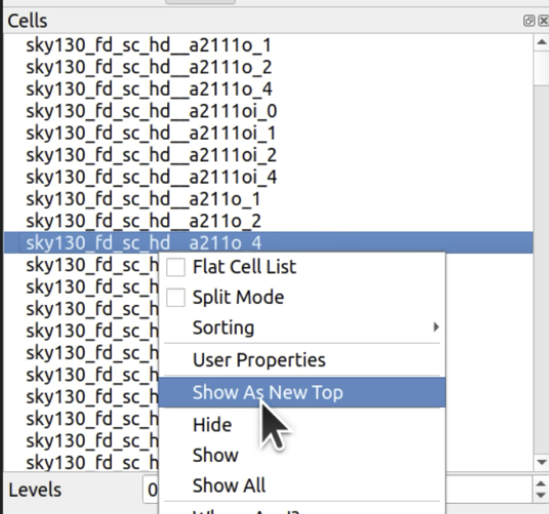
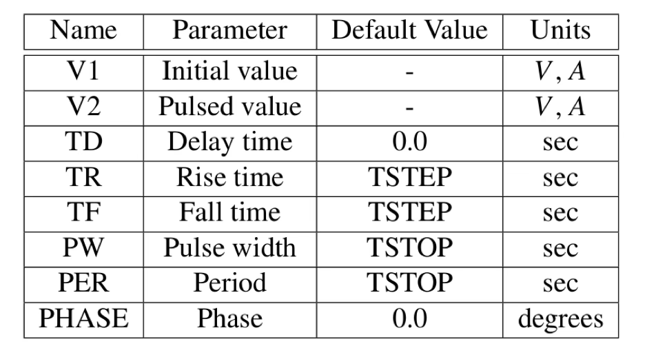
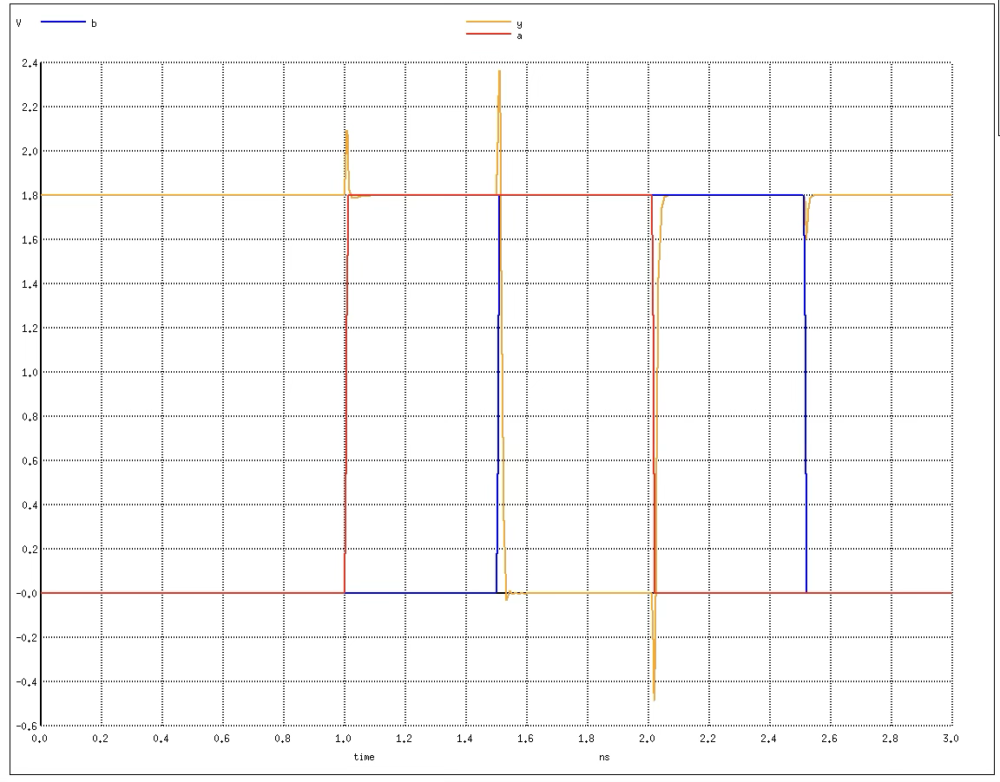
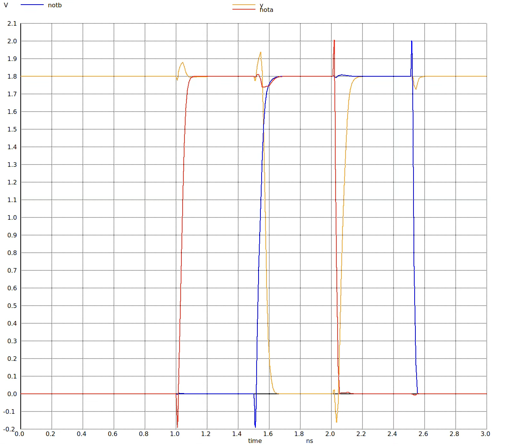

# Chose an standard cell and simulate it

## Setup the tools

- Start the docker, enable the sky130a PDK and change to the repository: 
./start_x.sh
iic-pdk sky130A

- Be sure you have already cloned the [Digital-Asic-Design](https://github.com/divadnauj-GB/Digital-ASIC-Design.git) repository. If you already have it, skip this step.
 
    ```bash
    git clone https://github.com/divadnauj-GB/Digital-ASIC-Design.git
    ```

- Enter into the Turorial 3.0 as follows

    ```bash
    cd ./Digital-ASIC-Design/Tutorials/3.0.Satndard_cell_simulation
    ```

## The standard cells

The PDK contains all the information we need to create correct files to send to the foundry.
You can consult the Terminology glossary if you happen upon any unfamiliar terms.
I interviewed Prof. James Stine about creating open-source standard cells if you want to learn more about their design: https://www.zerotoasiccourse.com/post/interview-with-james-stine/
Among the many files are the standard cells. These are regular sized units that can fulfil a simple function such as AND, OR, NOT gates, or flip-flops for storing a bit of data.

In the Tutorial 3.3 directory run this command

```bash
make show_cells
```

This will start klayout and load all the high density (hd) cells. Take a look through and choose one that you’d like to simulate. You can scroll through the top left pane and then right click ‘show as new top’.




I’ll continue this example after having chosen a 2 input nand gate: `sky130_fd_sc_hd__nand2_1`. The _1 at the end of the name means that it has a 1x drive strength.

[Here’s a video]((https://www.youtube.com/watch?v=ajwZVAVo3yk&t=1s)) if you’re curious about when drive strength is important.


## Adjust the simulation.spice file

Look at simulation.spice
- The first line is the title of the simulation.
- The .lib file includes the models for the transistors. 
- The .include line includes all the standard cells.
- The line starting with Xcell instantiates the model of your standard cell. You need to make sure it matches with the subckt definition inside your cell’s spice model.

Open the included spice file `/foss/pdks/sky130A/libs.ref/sky130_fd_sc_hd/spice/sky130_fd_sc_hd.spice`. Search for your chosen cell.

You can use `grep` to help you search, for example to find cells that match `‘xor’`:

```bash
grep xor /foss/pdks/sky130A/libs.ref/sky130_fd_sc_hd/spice/sky130_fd_sc_hd.spice
```

The `subckt` line defines the module’s inputs and outputs. We need to make sure when we instantiate it in the `simulation.spice` file, all the connections are made correctly. You will typically have connections for power, ground, substrate, inputs and outputs.

**VNB** is the substrate and should be connected to **VGND**. **VPB** is the `n-well` for **P** type MOSFETs and should be connected to **VPWR**. The `n-well` is a region of n type semiconductor that insulates the p diffusion layer from the p type substrate. This is why n channel MOSFETs don’t need a well, but p types do.

My 2 input nand example’s definition is like this:

```subckt sky130_fd_sc_hd__nand2_1 A B VGND VNB VPB VPWR Y```

So I adjust my `simulation.spice` file to instantiate it like this:

```Xcell A B VGND VGND VPWR VPWR Y sky130_fd_sc_hd__nand2_1```

## Adjust the pulse definitions

The `simulation.spice` file also contains the commands to create the inputs and plot the outputs.

Take a look and read the comments. You won’t need to adjust the gnd and power nets but you will probably need to adjust the pulse creation and the plotting.

Let’s take a look at how the pulse command works. Load the [ngspice-31 manual](https://ngspice.sourceforge.io/docs/ngspice-manual.pdf) and go to section 4.1.1. The parameters are:



The phase parameter is optional and I don’t use it in this example.

For my 2 input nand gate I want the **A** input to go high followed by the **B** input. **Va** and **Vb** are the names of the pulses. **A** and **B** are where the outputs of the pulses should get connected, and **VGND** are the grounds.

The 2 pulses are identical in terms of voltage, rise and fall time, pulse width and period. The only difference here is the delay. 1nS for **Va** and 1.5nS for **Vb**.

```bash
Va A VGND pulse(0 1.8 1n 10p 10p 1n 2n)
Vb B VGND pulse(0 1.8 1.5n 10p 10p 1n 2n)
```

You may also need to adjust the plot command. For my example I want to see the A and B inputs against the Y output, so I change the plot command:

```bash
plot A B Y
```

This plot command puts all the traces on one graph. If you want to separate it out into multiple graphs you can do so like this:

```bash
plot A B
plot Y 
```

You can also export the data to CSV. Check out the `ngspice` manual to learn how.

## Simulate It

After you’ve written the files, you can run the simulation by typing this command on the command line:

```bash
make sim
```

The result should be a graph that shows the inputs vs the outputs.

Write out your truth table for your cell.

| A | B | Y |
| -- | -- | -- |
|  0 |  0 |   |
|  0 | 1  |   |  
|  1 |  0 |   |  
|  1 |  1 |   |  

Here you can see the **Y** output starts high as both **A** and **B** are low. Then **Y** drops low at 1.5ns when both **A** and **B** are high. At 2ns when **A** goes low, **Y** goes high again. 



## Measure propagation delay

To get a better accuracy on how long it takes for the gate’s output to change after the inputs change, we can zoom in on the graph and then use the mouse to make a measurement.

Right click and drag a small box at one of the changes at 0.9v. 

I'm choosing the change at 1.5ns. A new window will pop up showing the zoom. Then left click to draw a line between the 2 traces at 0.9v.

In the terminal ngspice will print out the start and end points of the line as seconds and volts coordinates. The dx value is the difference between the start and end point of the line. For the nand gate I measured about 2.2e-11 seconds.

What value do you get? Do you think it’s accurate?

Assuming it’s accurate, if we wanted to run a clock at 100MHz, how many nand gates could we chain before running out of time?


## Discussion
The models of the standard cells are fairly accurate - we even have different simulations for different temperatures and process variations. However, taking this measurement and assuming it will stay the same when we chain lots of gates is missing a lot of detail including:

- Resistance and propagation time through the connecting wires,
- The spice file we used doesn’t include any parasitics,
- We are ignoring the threshold of the high and low levels, and just measuring at around 0.9v,
- The input pulse is taking 10ps to rise, but the reality depends on the drive strength of the gate driving this one,
- If the nand is part of some combinatorial logic that we want to capture into a flip flop, then we also have to take into account the setup and hold time of the flip flops in use.

If you are interested to find out more about this, there is a method called `‘logical effort’` that can be used as a simple way to calculate delay and propagation time.

If we ignore all the above, then with a clock frequency of 100MHz, the period is 10ns. With a propagation delay of 22ps we could chain ~454 nand gates.

Let’s try adding some realism to the model:

- More realistic inputs - use an inverter to drive the inputs instead of the pulses
- More realistic wiring - add some 1 femto Farad of parasitic capacitance to the wires connecting the inverters to the nand gate.

The graph shows the effects of these changes:



The result was 3.84e-11s, or about 1.7 times slower.
This reduces the number of nands we could put in series to 260.
