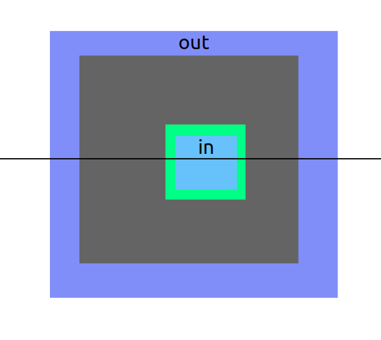
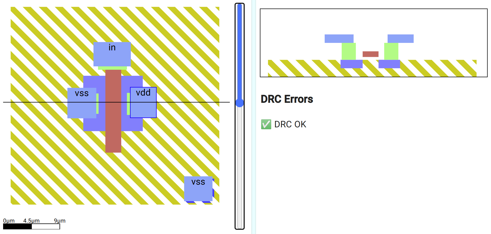
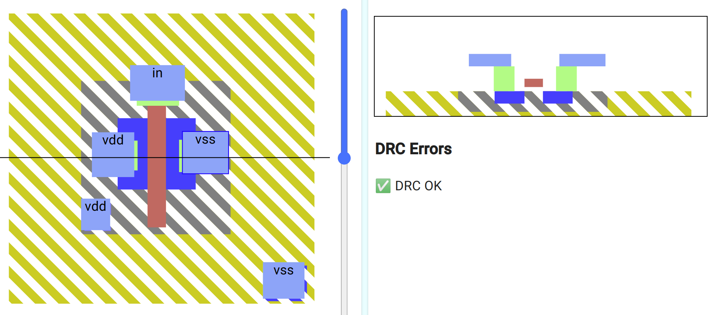
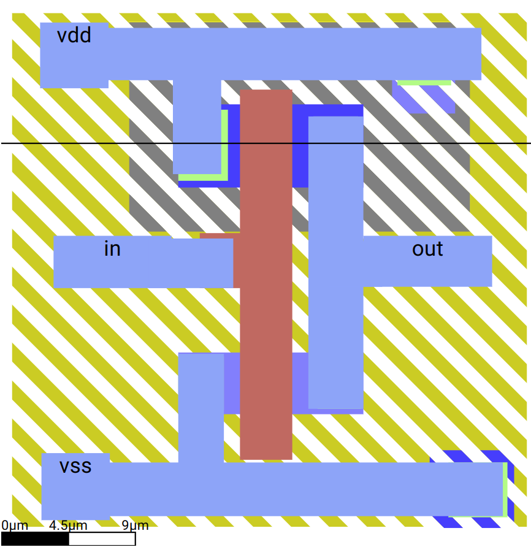

# Introduction to SiliWiz

## What is SiliWiz?

- SiliWiz is an online platform aiming to teach the principles of layout for silicon design. 
- Uses a simplified stack of layers, just enough to make a transistor

### Aims
- Draw your own logic gate and understand how that gate would be manufactured in a foundry.
- Learn how the gate is built out of the fundamental circuit elements used in chip design
- Understand how the drawings are used to manufacture the chip

### Note {.alert}
I'm not reinventing the wheel, instead we are going to follow the tutorials presented by SiliWiz

# Drawing Resistors
Let's follow the nice tutorial from siliwiz in this link: [https://tinytapeout.com/siliwiz/resistors/](https://tinytapeout.com/siliwiz/resistors/)

<div style="text-align: center;">
    
</div>


# Understanding Parasitics
Let's follow the nice tutorial from siliwiz in this link: [https://tinytapeout.com/siliwiz/parasitics/](https://tinytapeout.com/siliwiz/parasitics/)

# Drawing a Voltage divider
Let's follow the nice tutorial from siliwiz in this link: [https://tinytapeout.com/siliwiz/divider/](https://tinytapeout.com/siliwiz/divider/)

<div style="text-align: center;">
    
</div>

# Drawing a capacitor
Let's follow the nice tutorial from siliwiz in this link: [https://tinytapeout.com/siliwiz/capacitors/](https://tinytapeout.com/siliwiz/capacitors/)

<div style="text-align: center;">
    
</div>


# Drawing and N Mosfet
Let's follow the nice tutorial from siliwiz in this link: [https://tinytapeout.com/siliwiz/nmos/](https://tinytapeout.com/siliwiz/nmos/)

<div style="text-align: center;">
    
</div>


# Drawing a P Mosfet

Let's follow the nice tutorial from siliwiz in this link: [https://tinytapeout.com/siliwiz/pmos/](https://tinytapeout.com/siliwiz/pmos/)

<div style="text-align: center;">
    
</div>


# Drawing a CMOS inverter
Let's follow the nice tutorial from siliwiz in this link: [https://tinytapeout.com/siliwiz/cmosinverter/](https://tinytapeout.com/siliwiz/cmosinverter/)

<div style="text-align: center;">
    
</div>

```bash
```