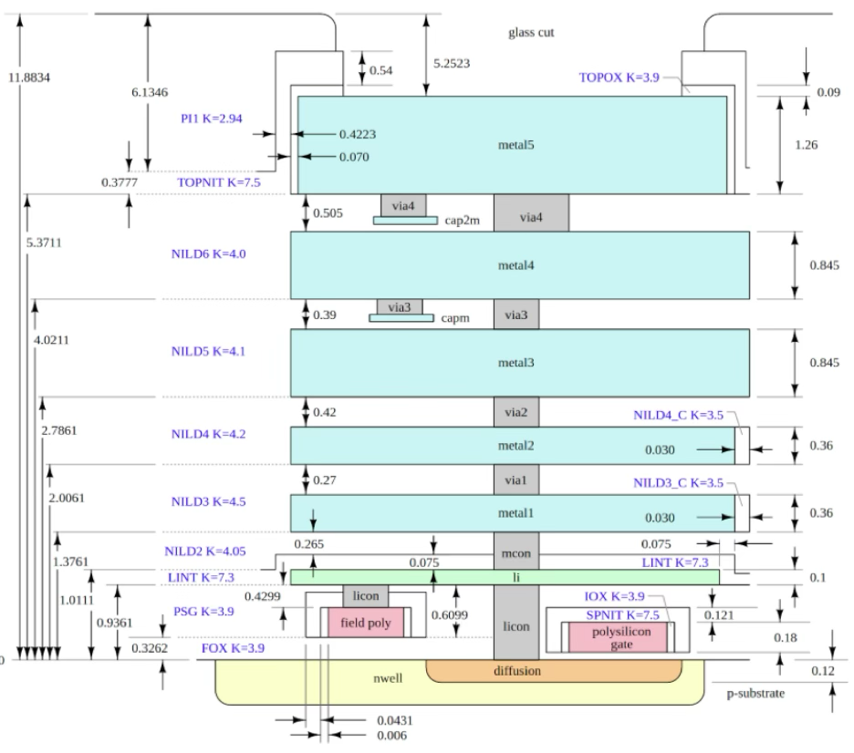
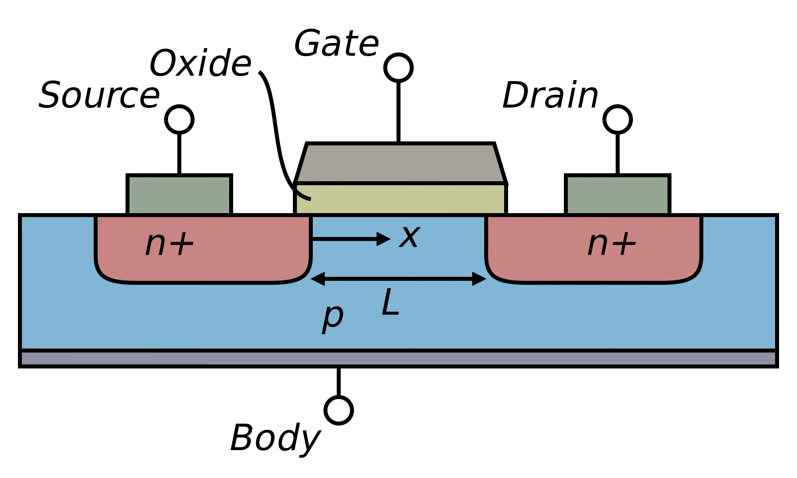
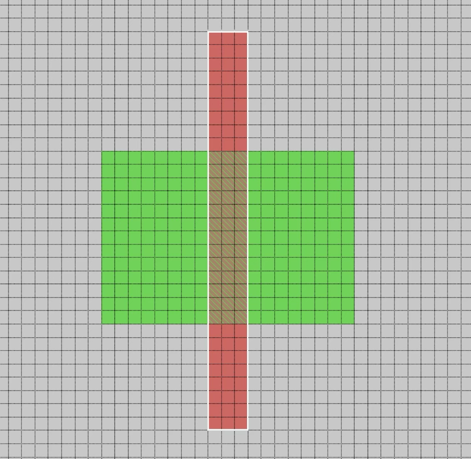
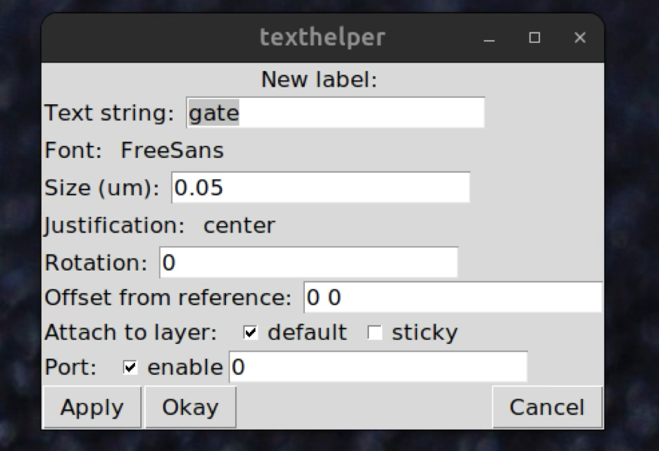
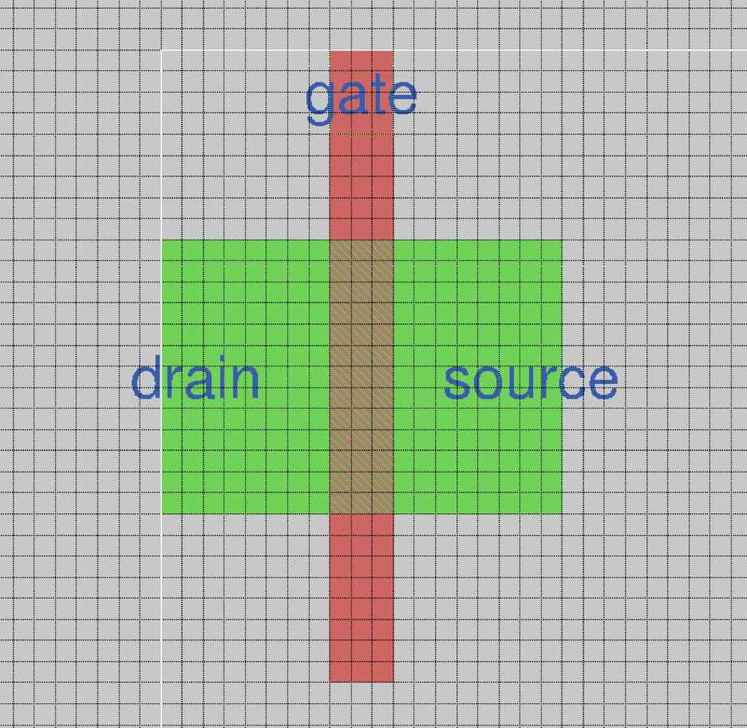
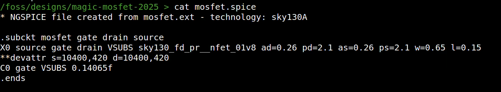
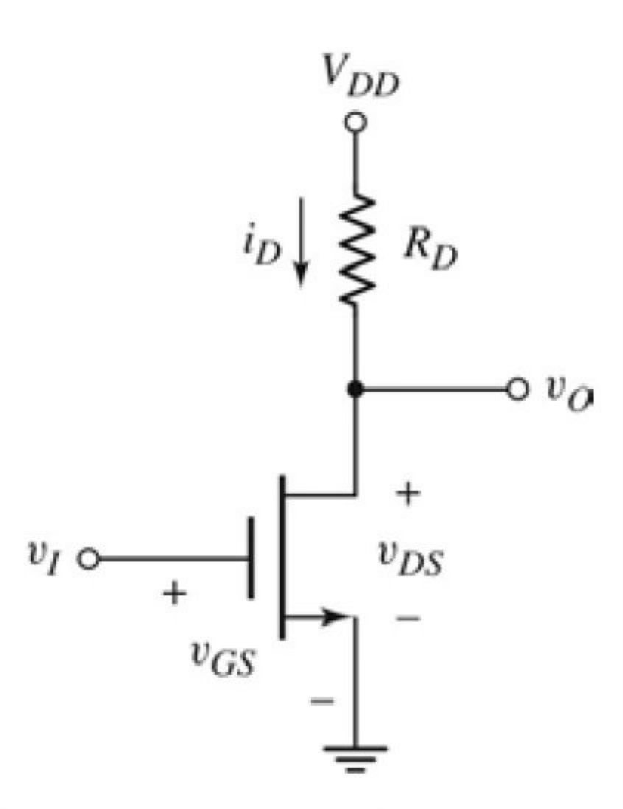
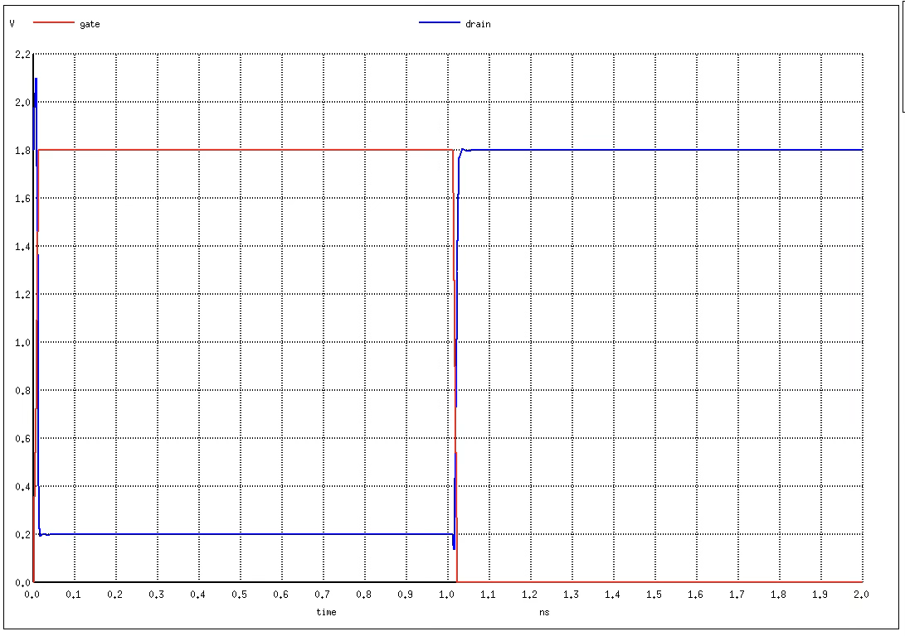
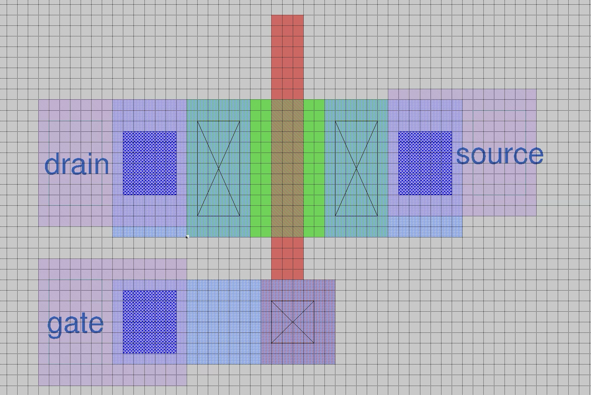
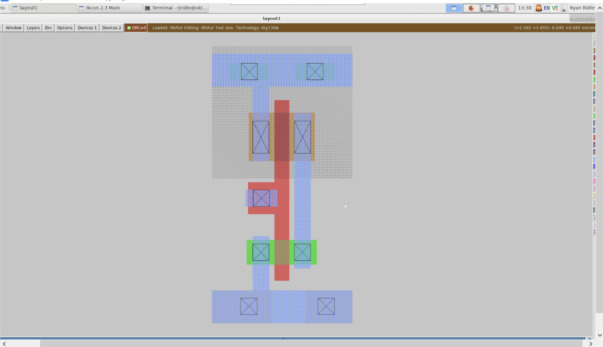

# Creating a N-Mosfet in SKY130nm with Magic

## Learning Objective
- 1.3 Draw a MOSFET in Magic
- Learn the basics of the Magic VLSI tool.
- Extract the circuit from a drawing.
- Simulate with ngspice.

## Preparing turorial prerequisites

- The tools & PDK installed
- Start the docker, enable the sky130a PDK and change to the repository: 

    ```bash
    ./start_x.sh
    iic-pdk sky130A
    ```
- The project repository cloned or updated either using one of the following commands:
    -  Update the repository to the last version

    ```bash
    cd ./Digital-ASIC-Design/Tutorials/3.2.Transistor_layout
    git pull
    ```

    - Clone the repository if you haven't gotten it yet.

    ```bash
    git clone https://github.com/divadnauj-GB/Digital-ASIC-Design.git   
    cd ./Digital-ASIC-Design/Tutorials/3.2.Transistor_layout
    ```

## Start Magic
We are going to draw a MOSFET using the VLSI tool called Magic. More information about Magic can be found [here](http://opencircuitdesign.com/magic/). It's a bit of an unusual GUI tool that takes some getting used to. 

If you're still not sure what a MOSFET is, or how it works - this [Veritasium video](https://www.youtube.com/watch?embed=no&v=IcrBqCFLHIY) is highly recommended. For a more in depth look at MOSFETs, [Behzad Razavi's lecture](https://www.youtube.com/watch?embed=no&v=dlOlxAcfBo4&list=PLyYrySVqmyVPzvVlPW-TTzHhNWg1J_0LU&index=29) is well taught and comprehensible.

The first thing to do is start Magic. We need to include a startup file that will load the tech file that describes the Skywater 130nm process. This will make sure we are using the correct layers, and it will also load the [DRC](https://www.zerotoasiccourse.com/terminology/drc/) rules. 

You can read much more about the [DRC rules here](https://skywater-pdk.readthedocs.io/en/main/rules/background.html) (click on the left menu to expand the 'Design Rules' section).
In the project repository you can run

```bash
make magic
```

Or you can type this command that will do the same thing:

```bash
magic -rcfile $PDK_ROOT/sky130A/libs.tech/magic/sky130A.magicrc mosfet.mag
```

The magicrc file tells Magic where to find the information about the PDK. If this isn't set correctly then you will not get the full palette of materials on the right and Magic will complain about there being no tech file.

Magic will start with the GUI window and the tcl command window

I find it useful to make a few changes to the GUI:
- Window -> Grid On
- Window -> Set Grid 0.05um
- Window -> Snap-to-Grid on
- Options -> Crosshair


## Painting in Magic
The way to paint a rectangle is to use the left mouse button to select the one corner of the box, and the right mouse button to select the opposite corner of the box.

Once you have defined the area you can use the middle button on one of the palette squares to fill the box. If the type of material you want is already on the screen you can middle click that instead to fill the box with the same material. You can also use the **'paint'** command in the tcl window. 

To erase what's in the box, middle click on empty space.

Some useful GUI shortcut keys:
- z - zoom in
- Z - zoom out
- Ctrl-z - zoom to the box

To create an exact sized piece of material you can either use the coordinate display in the top right corner of the window, or in the tcl command window you can use the box command to set a specific size.

```bash
box 0 0 150nm 150nm
```

This will create a 150nm square box at the origin. Then you can use the left mouse button to set a new bottom left position for the box.

For a cheatsheet of lots of the key codes, see [Harald Predtl's Magic Cheatsheet](https://github.com/hpretl/iic-osic/blob/main/magic-cheatsheet/magic_cheatsheet.pdf).


## Layers in Magic
Each type of **'paint'** in the palette on the right corresponds to a different layer in the ASIC stackup. When the drawing is finished, the GDS can be exported and each layer is then used in turn to build the ASIC in the foundry.



## MOSFET details
Now that we have some experience with Magic, we'll draw a MOSFET. This is a schematic symbol for a MOSFET. As you can see it is a 4 connection device:
 
- G - gate
- D - drain
- S - source
- B - body

For an N type MOSFET, the body is the P type substrate and is connected to the source.


Here's the cross section of what we want to end up with:



A few things to note:

- We don't need to explicitly create the substrate, Magic assumes it is what we are drawing on top of.

- We will make the connection from the source to the substrate in the simulation file.

- Although the MOSFET looks symmetrical, in use we always tie the substrate to ground for an N channel and to supply for a P channel. These connections are made next to the source and it's this that creates the **'body diode’**.

## Draw the MOSFET
Draw the N Diffusion. In the palette the name is **ndiffusion**. The critical dimension is the width (the top view makes it more natural to call it height, but the custom is to call it width). It needs to be 650nm. A good size would be 950x650nm. After drawing the box, either middle click on the green **ndiffusion** palette or type '**paint ndiffusion**' into the tcl window.

Over the top of it, draw the polysilicon gate. The palette name is **polysilicon**. The critical dimension here is the length (again, width seems more natural in a top down format, but gate length is the customary name). It needs to be 150nm. A good size would be 150nmx1500nm

When we paint polysilicon (the red colour) over N diffusion (the green), Magic automatically creates the transistor.



We also need to add the gate, drain and source connections by creating ports. 

Make sure to draw them in this order: gate, drain, source.

Do this by drawing a box over the part you want to be a port and then use the Edit -> Text menu. 

A window will open where you can set the size of the text, and click the port enable checkbox.




Once you're done, it should look like this:



## Extract the circuit

Now that we have the labelled drawing we can extract it. Save the file with the File->Save menu and if prompted choose the 'auto write' option in the dialog box.

Then in the terminal type this command:

```bash
make mosfet.spice
```

This runs a small tcl script called extract.tcl. Instead of running the script, you could also type these commands into the tcl window. The tcl window is one of the reasons why Magic is so easy to script.

Take a look at the resulting mosfet.spice file. It should be similar to this:



You can see the sky130 nfet has been extracted, and the most important parameters, the width and the length and set to 0.65 and 0.15 microns.


## Simulate it
Now we have the spice file, we can connect it up as an inverter by including a resistor. 



When the gate of the MOSFET is off, the output turns on because the resistor allows current to flow from the VDD power supply. When the gate of the MOSFET is on, it connects the 0v ground to the output.

Take a look at the simulation.spice file. The MOSFET has been instantiated with the source connected to ground. The gate is driven by the pulse command, and the drain is connected via a 10k ohm resistor to VDD.

Type this command in the terminal to run the simulation:

```bash
make sim
``` 

You should get a graph like this:



If you get an error about "could not find a valid modelname" check the dimensions of your extracted MOSFET. If they are not close enough to the Skywater130 standard, then ngspice will not be able to find a model that's close enough to match what you have drawn.


## Connecting the MOSFET

What we have drawn so far is good practice, but we are missing skills if we want to draw a new cell for the cell library. It's good to learn how to connect the MOSFET's connections up to the metal1 layer.

As you draw you will create lots of DRC errors. You will see the white hatching that shows an error, and see the number at the top of the window increase and turn red. Sometimes the DRC error will go away as you continue drawing; for example the contacts have DRC errors unless they are connected from both above and below.

To find out what went wrong you can click DRC->Find next error in the GUI window, or type `drc why` in the tcl command window.

The reports can be pretty confusing to understand and unfortunately there isn't really a shortcut as the DRC rules are so numerous and complex. It's not strictly necessary to end up with a DRC clean design as the extraction will probably work anyway but with DRC errors we couldn't manufacture it.

Start by erasing the labels. Put the box over each label and then typing in the command window:

```bash
erase label
``` 

Then create the contacts on the gate, drain and source. We have to use 2 different contacts:
 
- n diffusion contact (palette name `ndcontact`) connects between local interconnect and n diffusion.
- poly contact (palette name `pcontact`) connects between local interconnect and polysilicon.

Then use local interconnect (palette name `locali`) to draw wires away from the contacts.

Draw vias (`viali`) on top of the local interconnect. Then draw metal1 (palette name `metal1`) wires leading away.

Add new ports on the `metal1` connections as you did before. Make sure to make the ports in the correct order: `gate`, `drain` and `source`.

Your design should look like the following figure




Then run these commands to check if you got it right:

```bash
make clean
make mosfet.spice
make sim
```

## Making an inverter
 
If you really want to dive deep, prof James Stine and his students have made a [nice guide to drawing an inverter with magic](https://docs.google.com/document/d/1hSLKsz9xcEJgAMmYYer5cDwvPqas9_JGRUAgEORx1Yw/edit).

You should get something like this: 

