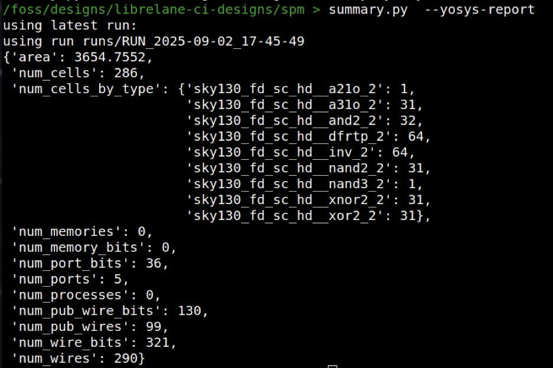

# LibreLane

## Preparing turorial prerequisites

- The tools & PDK installed
- Start the docker, enable the sky130a PDK and change to the repository: 

    ```bash
    ./start_x.sh
    iic-pdk sky130A
    ```
- The LibreLane examples cloned:

    ```bash
    git clone https://github.com/librelane/librelane-ci-designs.git
    ```

## Choose an example design
Change directory to where you cloned the LibreLane examples:

    ```bash
    cd librelane-ci-designs
    ls
    ```

You can also browse the list online: https://github.com/librelane/librelane-ci-designs. Unfortunately there isn’t much top level documentation, but the source files usually have some information about what they are doing.

**Note:** some of these projects are very large and take a long time & resources to complete. For example the aes and aes_core designs take around an hour on my machine.

Each design follows the same structure:

- `config.json` - configuration of the design
- `src/` - directory containing all the source files. No symlinks allowed!
- `runs/` - directory where results are stored (only after running the tools)

**Note** - A [recent bug](https://github.com/librelane/librelane/issues/759) means that designs that don't specify a `pin_order.cfg` will fail at Global Routing. 

## Read the config
The config files are a terrible blend of JSON & [tcl](https://en.wikipedia.org/wiki/Tcl) files. They used to be tcl, but now they are JSON with some tcl parsing. LibreLane still supports tcl format config files, but they will become unsupported in the future.

A lot of the configuration can be left to defaults. You can find a list of all the configuration options with their defaults here: https://librelane.readthedocs.io/en/latest/reference/step_config_vars.html

With the introduction of more PDKs, the config files now support a way of providing configurations for different PDKs. Here’s an [example](https://github.com/librelane/librelane-ci-designs/blob/main/spm/config.json).

Work through the config file of the design you have chosen and look up what all the variables are doing.


## Run the tools on your chosen design

To create the GDS files for the spm design, we just need to tell LibreLane what config file to use:

```bash
cd spm
librelane config.json
```

The time it will take is dependent on many things, but the size of the source plays a big part. Expect between 5 minutes and a few hours.

LibreLane generates a huge amount of output, and this can cause problems with knowing what is important and what can be ignored. All of it gets logged in the output directory, so we can inspect the most important parts after the run has finished.

Everytime you run the tool, it will create a new directory under `./runs`. 

The directory is named like this: `RUN_year-month-day_hour-minute-second`.

Make sure you’re looking at the latest run’s results!

## Inspect the results
The number of files is overwhelming, and a lot of them are not important. I have done some work in categorising and labelling the most important files in this spreadsheet. The first tab is a sorted list of output files from a typical LibreLane run. The 2nd tab list file types:

[LibreLane important output files](https://docs.google.com/spreadsheets/d/1SePRLd8waVPa1BXPMB2cBOUIXK2lYbP_ace_7pNuEw8/edit?usp=sharing) and file types (check to make sure you are on the LibreLane tab)

Note that sometimes the filenames have numbers prepended as an indication of which order they were created. If some steps are not run (due to a change in config for example) then the numbering changes.

## Viewing different file types
We will mostly be looking at these file types: RPT, GDS, MAG, DEF. I much prefer KLayout to Magic to view files, and I have a summary tool that knows where the important files are located.

You can clone it from Matt Venn's github: https://github.com/mattvenn/librelane_summary. 

If a number is given as -1 (for example the cvs_total_errors), this means the test wasn’t run or the script couldn’t find the result.

A test might be skipped if the tool can’t cope with the design. For example the cvc tool is not run unless there is a single power domain. Other tests can be disabled in the config, for example I often disable DRC for a design using SRAM as the DRC will always fail with an SRAM in use.

Start the tool with `--help` to see the options. You need to have the runs directory in your current directory, or provide it with the `--runs` argument.



## Check some of the important files
At least take a look at these files:
- Final GDS: `summary.py --gds`
- Summary of the timing reports: `summary.py --timing`
- Final summary report:  `summary.py --summary`

The timing summary shows the reports for quite a few corners. To get more detailed information about a specific corner, you can open the specific file. For example 

- Min (hold) at 1.8v, 25C: *-openroad-stapostpnr/nom_tt_025C_1v80/min.rpt
- Max (setup) at 1.8v, 25C: *-openroad-stapostpnr/nom_tt_025C_1v80/max.rpt

[Check here for how to read](https://www.zerotoasiccourse.com/terminology/sta/) the reports and more info on setup and hold timing.

## Controlling the flow
As you've seen, the LibreLane flow consists of many steps, each one responsible for moving the design forwards.

For a list of all the steps check here: https://librelane.readthedocs.io/en/latest/reference/flows.html#included-steps

One of the nice features of LibreLane is the ability to stop at a certain step and then resume. This can be useful to save time, or to help explore the results of configuration variables.

For example, if we just want to get an idea of the number of standard cells involved we could run this command:

```bash
librelane config.json --to Yosys.Synthesis --run-tag synth
summary.py --yosys-report
```

This saves a lot of time as we don't need to wait for the flow to finish before checking the results.
Note that the `--run-tag synth` means that instead of getting a timestamped directory name, the results will be in `./runs/synth`

Or for example, say Synthesis took an hour, and we want to experiment with `FP_CORE_UTIL`, after running the above command, we could continue to the end of the flow with this:

```bash
librelane config.json --run-tag core_util_60 --from Yosys.Synthesis --with-initial-state runs/synth/06-yosys-synthesis/state_out.json -c FP_CORE_UTIL=60
```

This will create a new directory called `core_util_60` in runs, and continue from the synthesis step we ran before, while also over-riding the `FP_CORE_UTIL` from 45 to 60.

## Inspecting the design with the OpenROAD GUI
Another method to further inspect your design is to use the Openroad GUI. 

To open the latest LibreLane run with the GUI, use this command:

```bash 
librelane --last-run --flow OpenInOpenROAD config.json
```


