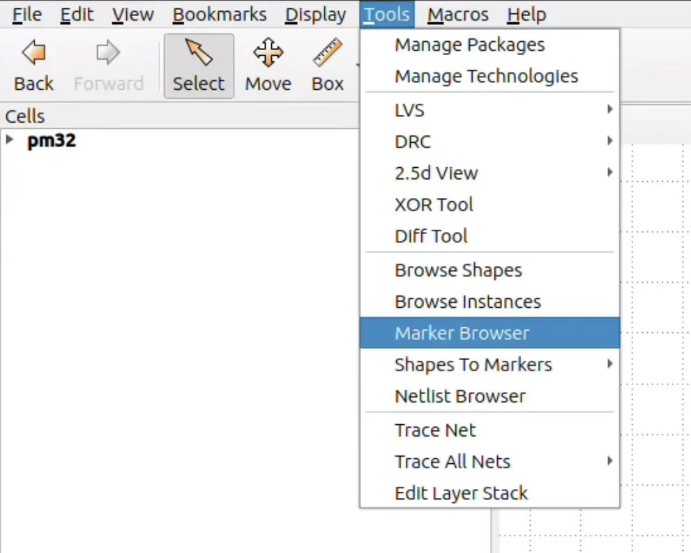
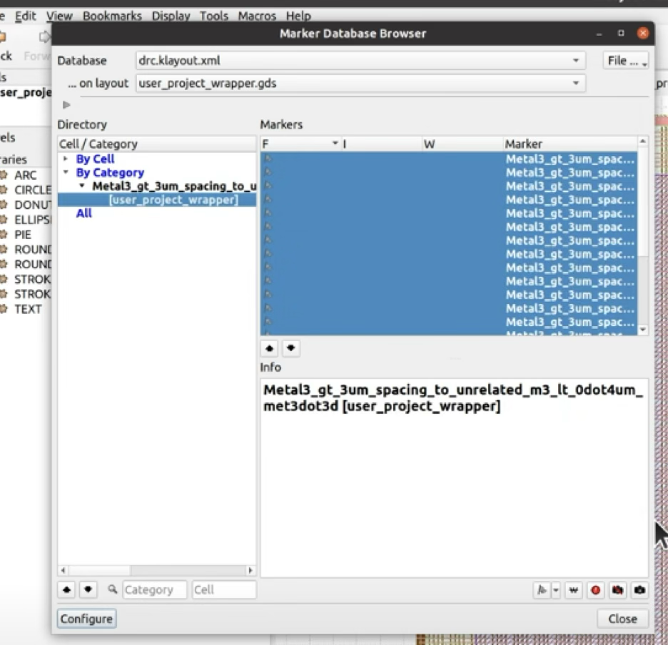

# Librelane and rgb_mixer

## Preparing turorial prerequisites

- The tools & PDK installed
- Start the docker, enable the sky130a PDK and change to the repository: 

    ```bash
    ./start_x.sh
    iic-pdk sky130A
    ```
- The Rgb-Mixer project with a testbench

## Create a new design
I will use the rgb_mixer as the example for this project. Wherever you see reference to it, make sure to substitute correct details from your own project.

Start with this config, and save it to `config.json`:

```json
{
    "DESIGN_NAME": "<top name>",    
    "VERILOG_FILES": "dir::src/*.v",   
    "CLOCK_PORT": "clk",
    "CLOCK_PERIOD": 20,    
    "FP_PIN_ORDER_CFG": "dir::pin_order.cfg"
}
```

Adapt it to match:
- Your top module's name
- Your source directory
- The clock port is correct
- The clock period is in ns, so this 20ns means 50MHz. A lower speed is easier for the tools, so start at 20 and then try to reduce it later if you want to try running faster.

Due to a current LibreLane bug, we have to define where the pins are or the flow will fail. That's done with the `FP_PIN_ORDER_CFG` variable, which specified the `pin_order.cfg` file. 
[Here's](pin_order.cfg) my config file for the rgb_mixer. 

```bash
#N
#S
#E
PWM.*
#W
clk.*
rst.*
inc.*
dec.*
led.*
```

Make your own pin_order.cfg file and make sure you have a match for each pin in your top module's definition.

## Run LibreLane!
Finally! We have got to the part of the course where you are going to make the GDS files for a custom IC!

Run LibreLane with your own config file:

```bash
librelane config.json --run-tag rgb_mixer_chip
```

After the run finishes, check the results. Did you get something or did the tools fail with an error? There are a few common problems we will look at below, but resolving issues often requires a bit of patience, trial and error. 

If you got a result, then check the metrics.csv or run `summary.py --summary`. Ideally we are looking for 0 violations or errors. Only some can be waived. The safest is to have everything reported be 0.

## Ignorable Warnings
LibreLane will often end with warnings. Some of these can be safely ignored:

```bash
WARNING  [OpenROAD.CheckSDCFiles] 'PNR_SDC_FILE' is not defined. Using generic fallback SDC for OpenROAD PnR steps.
[OpenROAD.CheckSDCFiles] 'SIGNOFF_SDC_FILE' is not defined. Using generic fallback SDC for OpenROAD PnR steps.
```

If no timing SDC files are provided, defaults will be used. You can ignore this if you are not working with multiple macros.

```bash
[Odb.CustomIOPlacement] Overriding minimum distance 0.1 with 0.42 for pins on side N to avoid overlap.
```

Just a notice that the pins are being set wider to avoid overlap - safe to ignore.

```bash
OpenROAD.RepairDesignPostGPL] [STA-1140] /foss/pdks/sky130A/libs.ref/sky130_fd_sc_hd/lib/sky130_fd_sc_hd__tt_025C_1v80.lib - library sky130_fd_sc_hd__tt_025C_1v80 already exists. 
```

When trying to load multiple corners of the same library, OpenROAD emits this warning. Safe to ignore.

```bash
[OpenROAD.DetailedRouting] [DRT-0349] LEF58_ENCLOSURE with no CUTCLASS is not supported. Skipping for layer mcon
```

The LEF files for sky130 have some properties not supported by OpenROAD, so it emits this warning. Safe to ignore.

```bash
[Checker.WireLength] Threshold for Threshold-surpassing long wires is not set. The checker will be skipped.
```

You can set a threshold for the maximum wire length in the circuit where if there is any wire longer than that, an error is raised. It doesn't have a default sane value and for small designs it can be ignored.

Other warnings should be checked to make sure they are not serious. 

## Debugging LibreLane Errors
Read the last 20 or 30 lines of log output. A lot won’t make sense but it’s easy to spot basic configuration issues. 

- Broken configuration, typos or bad paths mean the tools barely get started.
- Synthesis tools don’t find design. Not all the source has been specified, or it has dependencies not yet fulfilled (for example uninitialised git submodules).
- Syntax error in the HDL of the design.
- Tools can’t find the clock - for example your clock is not named clk. Update the configuration file.
- Linter errors - take a look at the linter log file: `01-verilator-lint/verilator-lint.log`

- Design too small for routing:
    - Very small designs often need these parameters reducing: `FP_CORE_UTIL` (default is 45)
    - Try making the design area bigger by reducing `FP_CORE_UTIL`
    - Try spreading out the cells by reducing `PL_TARGET_DENSITY_PCT`
- Design too small for a power distribution network:
    - Set the absolute size of the design:
    - set `FP_SIZING` absolute
    - set `DIE_AREA` to [0,0,200,200] to define a 200x200um area.
    - If `FP_SIZING` is set to absolute then `FP_CORE_UTIL` is not used.
- Design too big (fails due to congestion or overlaps)
    - Don’t set the design to be absolute, and reduce the density - allows the tools to pick the die size
    - Use the `summary.py` tool to check the detailed placement
    - Another option is to go back to absolute sizing, choosing 25% larger than what the tools calculated automatically. Use the layout from detailed placement to measure the size of the die on the previous failed run.
- Design fails hold timing:
    - Use these variables to add extra hold timing slack (unit is in ns). The default is 0.1.
        - `PL_RESIZER_HOLD_SLACK_MARGIN` to 0.8
        - `PL_RESIZER_HOLD_SLACK_MARGIN` to 0.8
- DRC failures
    - Load the xml marker database with KLayout and inspect the errors - this may help you to work out what is going wrong. Instructions for doing this are coming up.

## Common issues when the tools finish
Run the `summary.py --summary` tool or check the metrics.csv file by hand. Check all the columns named error or violation. The most common ones are:
- Shorts: short circuits in the routing. This will cause many DRC and LVS issues as well.
- LVS: layout vs schematic:
    - This can be due to shorts in the routing. Check to make sure you don’t have shorts.
    - This can also mean your design is not driving all its outputs. Check in `*-magic-writelef/magic-writelef.log` for the keyword ‘Mismatch’ and check your design is driving all the mismatching pins.
- Antenna: the antenna DRC rules are not crucial. They are a bit of a fuzzy check. If we have connecting wires too long they can pick up charge and damage MOSFET gates. LibreLane deals with this by inserting antenna diodes but sometimes there are not enough or there isn’t enough space to do so. Try increasing the size of the design. You can also try changing the diode placement strategy. More information about the antenna report here. It is not vital to get 0 antenna issues.
- DRC issues. Most DRC issues can’t be waived and need to be fixed. The tools are getting better and better, but still sometimes need some help.
- Reports that are -1 are usually due to the check not being run. CVC errors are ok to -1, but DRC and LVS must be 0.

## Debugging DRC with KLayout
If DRC fails, we can use KLayout to open the XML marker database.

Open the GDS file with KLayout with one of these options:

```bash
1. summary.py --gds
2. librelane --last-run --flow openinklayout config.json
3. klayout <the design's GDS file> 
```

Then in the menu bar select Tools -> Marker Browser. A new window should open.



Click File -> Open and then select one of the DRC report files:
- `*-magic-drc/reports/drc.klayout.xml`
- `*-klayout-drc/report/drc.klayout.xml`

You'll then be able to see the list of DRC issues by cell and category.



## Gate Level simulation
To be extra sure that things are going to work, we can do a gate level simulation. This can be a lot slower than the previous iverilog simulations because we are simulating all the standard cells that make up the design.

Another limitation is that the gate level netlist is essentially a 'black box'. We can't reach inside with cocotb and get the values of any of the registers or wires. We can only talk to the design through the ports defined in the top level module.

On the positive site, making sure you can test and debug your design only through the top level ports will make your design easier to debug and test when it's in silicon!

You can find the powered gate level Verilog here: `./runs/rgb_mixer_chip/final/pnl/<your design>.pnl.v` then copy the powered verilog and inserted the following 5 lines:

```verilog
`define UNIT_DELAY #1
`define FUNCTIONAL
`define USE_POWER_PINS
`include "libs.ref/sky130_fd_sc_hd/verilog/primitives.v"
`include "libs.ref/sky130_fd_sc_hd/verilog/sky130_fd_sc_hd.v"
```

In the Makefile I added a new rule for the gate level test that also included the sky130A libraries:

```makefile
test_gate_level:
	rm -rf sim_build/; mkdir sim_build/
	iverilog -o sim_build/sim.vvp -s rgb_mixer -s rgb_mixer_vcd -g2012 ./runs/rgb_mixer_chip/final/pnl/rgb_mixer.pnl.v ./tb/rgb_mixer_vcd.v -I $(PDK_ROOT)/sky130A
	MODULE=tb.tb_rgb_mixer vvp -M $$(cocotb-config --prefix)/cocotb/libs -m libcocotbvpi_icarus sim_build/sim.vvp 
	! grep failure results.xml
```

Then, when setting up the test I needed to provide power and ground with the cocotb_test:

```python
async def my_first_test(dut):
    dut.VPWR.value = 1
    dut.VGND.value = 0
    """Main test bench sequence"""
```

If this test fails, it can sometimes highlight an issue in the design that wouldn't be detected with a Verilog simulation but would affect the chip.

