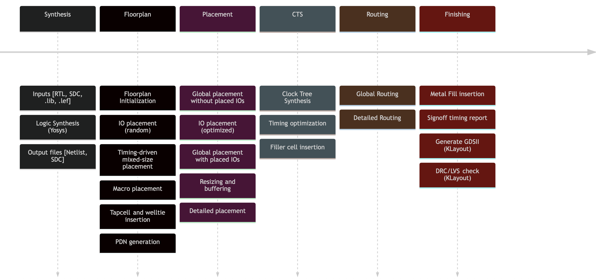
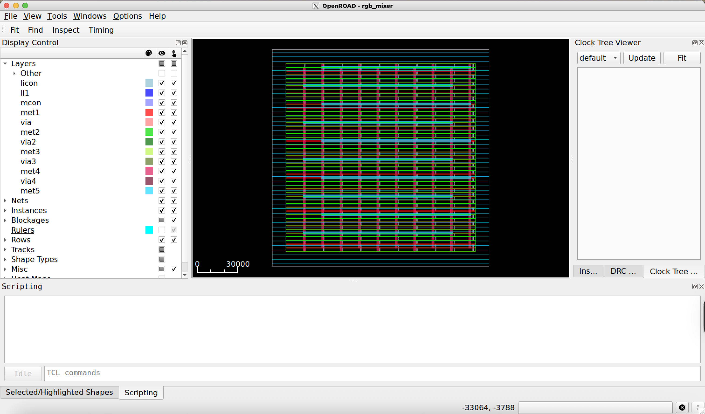

# Physical Design Using OpenROAD

## OpenROAD flow

<div style="text-align: center;">
    
</div>

- **OpenROAD** is a leading open-source, RTL-to-GDSII digital design toolchain designed to enable "no-human-in-the-loop" (NHIL) physical design in 24 hours.

---

### OpenROAD flow Steps

- The main steps of the flow are the following: 
    - Synthesis (Using Yosys)
        - RTL to GateNetlist
    - Floorplan 
        - Chip definition areas
        - PDN
    - Placement
        - Std-Cells placement on the chip
    - Clock Tree Synthesis (CTS)
        - Routing and buffering clock signals accross the chip
    - Routing 
        - Routing all cells interconnections
    - Finishing
        - Generate the GDS, Extracting parasitics, DRC and LVS checking

# OpenROAD Flow Scripts

- OpenROAD is the core of several automatized flows (RTL-GDSII) such as [**Librelane**](https://librelane.readthedocs.io/en/latest/). We will use **Librelane** later, but for now it is essential to undertand what happens underneath. 

- To use OpenROAD, it is necesary to setup an environment mainly based on TCL scripts. By luck we do not need to write all scripts from scratch, instead we are going to use the suggested OpenROAD Flow Scripts (OFS). 

- This tutorial has adapted some of the basic OFS in order to speed up the design flow. 

- This and the OpenROAD related tutorials contain two directories; 
    - **`OpenROAD`**: Allocates the core set of scripts for setting up the tool and the `PDK`
    - **`scripts`**: Includes the main flow script and the main script for processing the target design.


--- 

## OpenROAD OFS core scripts

```bash
|-- OpenROAD
|   |-- sky130hd
|   |   |-- sky130hd.pdn.tcl
|   |   |-- sky130hd.rc
|   |   |-- sky130hd.rcx_rules
|   |   |-- sky130hd.tracks.tcl
|   |   |-- sky130hd.vars.tcl
|   |-- flow_helpers.tcl
|   |-- helpers.tcl
```

- The core scripts are grouped into `PDK` related scripts ([**`sky130hd`**](./OpenROAD/sky130hd/)) and `helper` scripts used across the whole environment. 


### `sky130hd` scripts

- [`sky130hd.pdn.tcl`](./OpenROAD/sky130hd/sky130hd.pdn.tcl): Definition of the Power Distribution network across the chip.
- [`sky130hd.rc`](./OpenROAD/sky130hd/sky130hd.rc): Resistance and capacitance definitions for the `PDK` layers.
- [`sky130hd.rcx_rules`](./OpenROAD/sky130hd/sky130hd.rcx_rules): Parasitics extraction rules from the `PDK`
- [`sky130hd.tracks.tcl`](./OpenROAD/sky130hd/sky130hd.tracks.tcl): Definitions of the grid creation where to place all the std cells. 
- [`sky130hd.vars.tcl`](./OpenROAD/sky130hd/sky130hd.vars.tcl): Environment setup, library selection etc.

---

### `helper` scripts
- [`flow_helpers.tcl`](./OpenROAD/flow_helpers.tcl): Defines functions for handling files and libraries across the OpenROAD flow.
- [`helpers.tcl`](./OpenROAD/helpers.tcl): Defines functions and environmental variables in the form of OpenROAD utilities.

### PDK config script

- Most of the scripts use the default setup of the PDK; However the `sky130hd.vars.tcl` script can be edited to modify features aociated tot he PDK or the behaviour of OpenROAD. 

- Have a look to the OpenROAD scripts and try to explain what is the rough functionality they have incorporated.

## OpenROAD OFS flow scripts
```bash
|-- scripts
|   |-- flow.tcl
|   |-- rgb_mixer_sky130hd.sdc
|   |-- rgb_mixer_sky130hd.tcl
```

### `flow` scripts
- [`flow.tcl`](./scripts/flow.tcl): Implement the main OpenROAD flow commands (e.g, floorplan, IO placement, global palcement routing, etc).
- [`rgb_mixer_sky130hd.sdc`](./scripts/rgb_mixer_sky130hd.sdc): Design dependent, corresponds to all SDC contraints of the desing (e.g., clock, false paths, etc).
- [`rgb_mixer_sky130hd.tcl`](./scripts/rgb_mixer_sky130hd.tcl): Design dependent, setups the project and loads the main netlist to continue the OpenROAD flow.


### Note {.alert}
- These scripts need to be adjusted according to the design.

# RGB Mixer example on OpenROAD

## RGB mixer: Floopplanning

- The main steps of the flow are the following: 
    - Synthesis (Using Yosys)
        - RTL to GateNetlist
    - **`Floorplan`** 
        - Chip definition areas
        - PDN
    - Placement
        - Std-Cells placement on the chip
    - Clock Tree Synthesis (CTS)
        - Routing and buffering clock signals accross the chip
    - Routing 
        - Routing all cells interconnections
    - Finishing
        - Generate the GDS, Extracting parasitics, DRC and LVS checking

## RGB mixer: Flow scripts

### `rgb_mixer_sky130hd.sdc` script
```tcl
create_clock -name core_clock -period 2.5 [get_ports clk]
set_all_input_output_delays
``` 

- This scripts specifies design constraints of the design such as: 
    - Timing constraints (clocks)
    - Multicycle constraints
    - Flase paths
    - power constraints
    - ecc.

### SDC files {.alert}
Making an `SDC` file for your design might depend on the requirments but also the characteristics of your design. A nice summary of other `SDC` options can be found in [https://medium.com/@medhakadam21/synopsys-design-constraints-5784aa736c9e](https://medium.com/@medhakadam21/synopsys-design-constraints-5784aa736c9e)

---

### `rgb_mixer_sky130hd.tcl`
```tcl
# loading environment setup scripts
source "OpenROAD/helpers.tcl" 
source "OpenROAD/flow_helpers.tcl"
source "OpenROAD/sky130hd/sky130hd.vars.tcl"

# Setting up the design
set synth_verilog "../5.0.OpenSTA/synth/rgb_mixer_gl.v"
set design "rgb_mixer"
set top_module "rgb_mixer"
set sdc_file "scripts/rgb_mixer_sky130hd.sdc"
set die_area {0.0 0.0 160.0 160.0}
set core_area {10.0 10.0 150.0 150.0}

set slew_margin 20
set cap_margin 20

set global_place_density 0.9

# Runs the execution flow
include "scripts/flow.tcl"
```

- This script establishes the designd details (e.g., verilog files, sdc files, die area, core area)
- Modify this file according to your design.

---

### `flow.tcl`

- This script contains the sequence of OpenROAD commands used during the floorplan stage. 

- The Following are the main floorplan commands in OpenROAD

    - `read_libraries`
    - `read_verilog`
    - `link_design`
    - `read_sdc`
    - `initialize_floorplan`
    - `remove_buffers`
    - `rtl_macro_placer`
    - `pdngen`

- Detailed list of OpenROAD commands: [https://openroad.readthedocs.io/en/latest/main/README2.html](https://openroad.readthedocs.io/en/latest/main/README2.html)

- The full script in this example is available in [./Tutorials/7.0.FloorPlanning/scripts/flow.tcl](./scripts/flow.tcl)

--- 

### `flow.tcl` 
```tcl
read_libraries
read_verilog $synth_verilog
link_design $top_module
read_sdc $sdc_file

set_thread_count [cpu_count]
# Temporarily disable sta's threading due to random failures
sta::set_thread_count 1

utl::metric "IFP::ord_version" [ord::openroad_git_describe]
# Note that sta::network_instance_count is not valid after tapcells are added.
utl::metric "IFP::instance_count" [sta::network_instance_count]

initialize_floorplan -site $site \
  -die_area $die_area \
  -core_area $core_area

#initialize_floorplan -utilization ${utilization} -aspect_ratio 1.0 -core_space 10.0 -site $site

source $tracks_file

# remove buffers inserted by synthesis
remove_buffers

if { $pre_placed_macros_file != "" } {
  source $pre_placed_macros_file
}

################################################################
# Macro Placement
if { [have_macros] } {
  lassign $macro_place_halo halo_x halo_y
  set report_dir [make_result_file ${design}_${platform}_rtlmp]
  rtl_macro_placer -halo_width $halo_x -halo_height $halo_y \
    -report_directory $report_dir
}

################################################################
# Tapcell insertion
eval tapcell $tapcell_args ;# tclint-disable command-args

################################################################
# Power distribution network insertion
source $pdn_cfg
pdngen

################################################################

set global_place_pad_db [make_result_file ${design}_${platform}.db]
write_db $global_place_pad_db

set routed_def [make_result_file ${design}_${platform}.def]
write_def $routed_def

set verilog_file [make_result_file ${design}_${platform}.v]
write_verilog $verilog_file

set verilog_file_pdn [make_result_file ${design}_${platform}_pdn.v]
write_verilog -include_pwr_gnd $verilog_file_pdn

set sdc_file [make_result_file ${design}_${platform}.sdc]
write_sdc  $sdc_file
```

## RGB mixer: Makefile

### OpenROAD Makefile
```Makefile
export RESULTS_DIR=$(PWD)/results

run: 
	@echo "Running floorplanning..."
	openroad scripts/rgb_mixer_sky130hd.tcl

clean:
	@echo "Cleaning up floorplanning results..."
	rm -rf results *.log
```

### Executing the Floorplan step
```bash
make clean run
```

### Open the GUI view
```bash
openroad> gui::show
```

---

## RGB mixer Floorplan result
<div style="text-align: center;">
    
</div>

---

## OpenROAD saving files

- After executing the floorplan flow, the tool automatically stores temporary files used in the subsequent steps. 

### Generated files
```bash
|-- results
|   |-- rgb_mixer_sky130hd_pdn-tcl.v # Verilog netlist with PWR pins
|   |-- rgb_mixer_sky130hd-tcl.db # OpenROAD database
|   |-- rgb_mixer_sky130hd-tcl.def # layout file
|   |-- rgb_mixer_sky130hd-tcl.sdc # SDC file # 
|   |-- rgb_mixer_sky130hd-tcl.v # Verilog netlist
```

