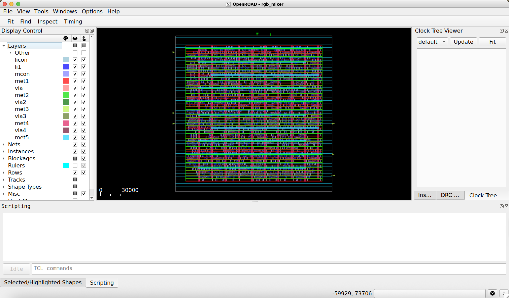

# RGB Mixer example on OpenROAD

## RGB mixer: Placement

- The main steps of the flow are the following: 
    - Synthesis (Using Yosys)
        - RTL to GateNetlist
    - Floorplan
        - Chip definition areas
        - PDN
    - **`Placement`**
        - Std-Cells placement on the chip
    - Clock Tree Synthesis (CTS)
        - Routing and buffering clock signals accross the chip
    - Routing 
        - Routing all cells interconnections
    - Finishing
        - Generate the GDS, Extracting parasitics, DRC and LVS checking

## RGB mixer: Flow scripts

### `rgb_mixer_sky130hd.sdc` script
```tcl
create_clock -name core_clock -period 2.5 [get_ports clk]
set_all_input_output_delays
``` 

- This scripts specifies design constraints of the design such as: 
    - Timing constraints (clocks)
    - Multicycle constraints
    - Flase paths
    - power constraints
    - ecc.

### SDC files {.alert}
Making an `SDC` file for your design might depend on the requirments but also the characteristics of your design. A nice summary of other `SDC` options can be found in [https://medium.com/@medhakadam21/synopsys-design-constraints-5784aa736c9e](https://medium.com/@medhakadam21/synopsys-design-constraints-5784aa736c9e)

---

### `rgb_mixer_sky130hd.tcl`
```tcl
# loading environment setup scripts
source "OpenROAD/helpers.tcl" 
source "OpenROAD/flow_helpers.tcl"
source "OpenROAD/sky130hd/sky130hd.vars.tcl"

# Setting up the design
set synth_verilog "../5.0.OpenSTA/synth/rgb_mixer_gl.v"
set design "rgb_mixer"
set top_module "rgb_mixer"
set sdc_file "scripts/rgb_mixer_sky130hd.sdc"
set die_area {0.0 0.0 160.0 160.0}
set core_area {10.0 10.0 150.0 150.0}

set slew_margin 20
set cap_margin 20

set global_place_density 0.9

# Runs the execution flow
include "scripts/flow.tcl"
```

- This script establishes the designd details (e.g., verilog files, sdc files, die area, core area)
- Modify this file according to your design.

---

### `flow.tcl`

- This script contains the sequence of OpenROAD commands used during the Placement stage. 

- The Following are the main placement commands in OpenROAD

    - `read_libraries`
    - `read_db floorplanning.db`
    - `read_sdc floorplanning.sdc`
    - `set_routing_layers`
    - `set_macro_extension`
    - `global_placement`
    - `place_pins`
    - `estimate_parasitics`
    - `repair_design`
    - `repair_tie_fanout`
    - `set_placement_padding`
    - `detailed_placement`

- Detailed list of OpenROAD commands: [https://openroad.readthedocs.io/en/latest/main/README2.html](https://openroad.readthedocs.io/en/latest/main/README2.html)

- The full script in this example is available in [./Tutorials/7.1.Placement/scripts/flow.tcl](./scripts/flow.tcl)

--- 

### `flow.tcl` 
```tcl
################################################################

# Assumes flow_helpers.tcl has been read.
read_libraries
read_db ../7.0.FloorPlaning/results/${design}_${platform}-tcl.db 
read_sdc ../7.0.FloorPlaning/results/${design}_${platform}-tcl.sdc

set_thread_count [cpu_count]
# Temporarily disable sta's threading due to random failures
sta::set_thread_count 1

utl::metric "IFP::ord_version" [ord::openroad_git_describe]
# Note that sta::network_instance_count is not valid after tapcells are added.
utl::metric "IFP::instance_count" [sta::network_instance_count]

################################################################
# Global placement

foreach layer_adjustment $global_routing_layer_adjustments {
  lassign $layer_adjustment layer adjustment
  set_global_routing_layer_adjustment $layer $adjustment
}
set_routing_layers -signal $global_routing_layers \
  -clock $global_routing_clock_layers
set_macro_extension 2

# Global placement skip IOs
global_placement -density $global_place_density \
  -pad_left $global_place_pad -pad_right $global_place_pad -skip_io

# IO Placement
place_pins -hor_layers $io_placer_hor_layer -ver_layers $io_placer_ver_layer

# Global placement with placed IOs and routability-driven
global_placement -routability_driven -density $global_place_density \
  -pad_left $global_place_pad -pad_right $global_place_pad

# checkpoint
set global_place_db [make_result_file ${design}_${platform}_global_place.db]
write_db $global_place_db

################################################################
# Repair max slew/cap/fanout violations and normalize slews
source $layer_rc_file
set_wire_rc -signal -layer $wire_rc_layer
set_wire_rc -clock -layer $wire_rc_layer_clk
set_dont_use $dont_use

estimate_parasitics -placement

repair_design -slew_margin $slew_margin -cap_margin $cap_margin

repair_tie_fanout -separation $tie_separation $tielo_port
repair_tie_fanout -separation $tie_separation $tiehi_port

set_placement_padding -global -left $detail_place_pad -right $detail_place_pad

detailed_placement

# post resize timing report (ideal clocks)
report_worst_slack -min -digits 3
report_worst_slack -max -digits 3
report_tns -digits 3
# Check slew repair
report_check_types -max_slew -max_capacitance -max_fanout -violators

utl::metric "RSZ::repair_design_buffer_count" [rsz::repair_design_buffer_count]
utl::metric "RSZ::max_slew_slack" [expr [sta::max_slew_check_slack_limit] * 100]
utl::metric "RSZ::max_fanout_slack" [expr [sta::max_fanout_check_slack_limit] * 100]
utl::metric "RSZ::max_capacitance_slack" [expr [sta::max_capacitance_check_slack_limit] * 100]

################################################################

set global_place_pad_db [make_result_file ${design}_${platform}.db]
write_db $global_place_pad_db

set routed_def [make_result_file ${design}_${platform}.def]
write_def $routed_def

set verilog_file [make_result_file ${design}_${platform}.v]
write_verilog $verilog_file

set verilog_file_pdn [make_result_file ${design}_${platform}_pdn.v]
write_verilog -include_pwr_gnd $verilog_file_pdn

set sdc_file [make_result_file ${design}_${platform}.sdc]
write_sdc  $sdc_file
```

## RGB mixer: Makefile

### OpenROAD Makefile
```Makefile
export RESULTS_DIR=$(PWD)/results

run: 
    @echo "Running floorplanning..."
    openroad scripts/rgb_mixer_sky130hd.tcl

clean:
    @echo "Cleaning up floorplanning results..."
    rm -rf results *.log
```

### Executing the Floorplan step
```bash
make clean run
```

### Open the GUI view
```bash
openroad> gui::show
```

---

## RGB mixer Placement result
<div style="text-align: center;">
    
</div>

---

## OpenROAD saving files

- After executing the floorplan flow, the tool automatically stores temporary files used in the subsequent steps. 

### Generated files
```bash
|-- results
|   |-- rgb_mixer_sky130hd_pdn-tcl.v # Verilog netlist with PWR pins
|   |-- rgb_mixer_sky130hd-tcl.db # OpenROAD database
|   |-- rgb_mixer_sky130hd-tcl.def # layout file
|   |-- rgb_mixer_sky130hd-tcl.sdc # SDC file # 
|   |-- rgb_mixer_sky130hd-tcl.v # Verilog netlist
```
