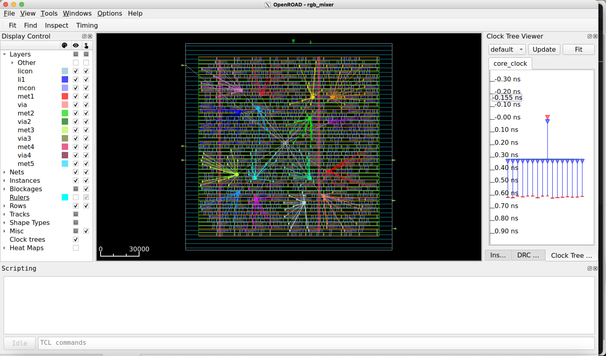

# RGB Mixer example on OpenROAD

## RGB mixer: Clock Tree Synthesis (CTS)

- The main steps of the flow are the following: 
    - Synthesis (Using Yosys)
        - RTL to GateNetlist
    - Floorplan
        - Chip definition areas
        - PDN
    - Placement
        - Std-Cells placement on the chip
    - **`Clock Tree Synthesis (CTS)`**
        - Routing and buffering clock signals accross the chip
    - Routing 
        - Routing all cells interconnections
    - Finishing
        - Generate the GDS, Extracting parasitics, DRC and LVS checking

## RGB mixer: Flow scripts

### `rgb_mixer_sky130hd.sdc` script
```tcl
create_clock -name core_clock -period 2.5 [get_ports clk]
set_all_input_output_delays
``` 

- This scripts specifies design constraints of the design such as: 
    - Timing constraints (clocks)
    - Multicycle constraints
    - Flase paths
    - power constraints
    - ecc.

### SDC files {.alert}
Making an `SDC` file for your design might depend on the requirments but also the characteristics of your design. A nice summary of other `SDC` options can be found in [https://medium.com/@medhakadam21/synopsys-design-constraints-5784aa736c9e](https://medium.com/@medhakadam21/synopsys-design-constraints-5784aa736c9e)

---

### `rgb_mixer_sky130hd.tcl`
```tcl
# loading environment setup scripts
source "OpenROAD/helpers.tcl" 
source "OpenROAD/flow_helpers.tcl"
source "OpenROAD/sky130hd/sky130hd.vars.tcl"

# Setting up the design
set synth_verilog "../5.0.OpenSTA/synth/rgb_mixer_gl.v"
set design "rgb_mixer"
set top_module "rgb_mixer"
set sdc_file "scripts/rgb_mixer_sky130hd.sdc"
set die_area {0.0 0.0 160.0 160.0}
set core_area {10.0 10.0 150.0 150.0}

set slew_margin 20
set cap_margin 20

set global_place_density 0.9

# Runs the execution flow
include "scripts/flow.tcl"
```

- This script establishes the designd details (e.g., verilog files, sdc files, die area, core area)
- Modify this file according to your design.

---

### `flow.tcl`

- This script contains the sequence of OpenROAD commands used during the CTS stage. 

- The Following are the main CTS commands in OpenROAD

    - `read_libraries`
    - `read_db placement.db`
    - `read_sdc placement.sdc`
    - `set_wire_rc`
    - `set_dont_use`
    - `repair_clock_inverters`
    - `clock_tree_synthesis`
    - `repair_clock_nets`
    - `detailed_placement`
    - `set_propagated_clock`
    - `repair_timing`
    - `detailed_placement`


- Detailed list of OpenROAD commands: [https://openroad.readthedocs.io/en/latest/main/README2.html](https://openroad.readthedocs.io/en/latest/main/README2.html)

- The full script in this example is available in [./Tutorials/7.2.CTS/scripts/flow.tcl](./scripts/flow.tcl)

--- 

### `flow.tcl` 
```tcl
read_libraries
read_db ../7.1.Placement/results/${design}_${platform}-tcl.db 
read_sdc ../7.1.Placement/results/${design}_${platform}-tcl.sdc

set_thread_count [cpu_count]
# Temporarily disable sta's threading due to random failures
sta::set_thread_count 1

utl::metric "IFP::ord_version" [ord::openroad_git_describe]
# Note that sta::network_instance_count is not valid after tapcells are added.
utl::metric "IFP::instance_count" [sta::network_instance_count]

################################################################
# Clock Tree Synthesis
set_wire_rc -signal -layer $wire_rc_layer
set_wire_rc -clock -layer $wire_rc_layer_clk
set_dont_use $dont_use
# Clone clock tree inverters next to register loads
# so cts does not try to buffer the inverted clocks.
repair_clock_inverters

clock_tree_synthesis -root_buf $cts_buffer -buf_list $cts_buffer \
  -sink_clustering_enable \
  -sink_clustering_max_diameter $cts_cluster_diameter

# CTS leaves a long wire from the pad to the clock tree root.
repair_clock_nets

# place clock buffers
detailed_placement

# checkpoint
set cts_db [make_result_file ${design}_${platform}_cts.db]
write_db $cts_db

################################################################
# Setup/hold timing repair

set_propagated_clock [all_clocks]

# Global routing is fast enough for the flow regressions.
# It is NOT FAST ENOUGH FOR PRODUCTION USE.
set repair_timing_use_grt_parasitics 0
if { $repair_timing_use_grt_parasitics } {
  # Global route for parasitics - no guide file requied
  global_route -congestion_iterations 100
  estimate_parasitics -global_routing
} else {
  estimate_parasitics -placement
}

repair_timing -skip_gate_cloning

# Post timing repair.
report_worst_slack -min -digits 3
report_worst_slack -max -digits 3
report_tns -digits 3
report_check_types -max_slew -max_capacitance -max_fanout -violators -digits 3

utl::metric "RSZ::worst_slack_min" [sta::worst_slack -min]
utl::metric "RSZ::worst_slack_max" [sta::worst_slack -max]
utl::metric "RSZ::tns_max" [sta::total_negative_slack -max]
utl::metric "RSZ::hold_buffer_count" [rsz::hold_buffer_count]

################################################################
# Detailed Placement

detailed_placement

# Capture utilization before fillers make it 100%
utl::metric "DPL::utilization" [format %.1f [expr [rsz::utilization] * 100]]
utl::metric "DPL::design_area" [sta::format_area [rsz::design_area] 0]

# checkpoint
set dpl_db [make_result_file ${design}_${platform}_dpl.db]
write_db $dpl_db

set verilog_file [make_result_file ${design}_${platform}.v]
write_verilog $verilog_file


set global_place_pad_db [make_result_file ${design}_${platform}.db]
write_db $global_place_pad_db

set routed_def [make_result_file ${design}_${platform}.def]
write_def $routed_def

set verilog_file [make_result_file ${design}_${platform}.v]
write_verilog $verilog_file

set verilog_file_pdn [make_result_file ${design}_${platform}_pdn.v]
write_verilog -include_pwr_gnd $verilog_file_pdn

set sdc_file [make_result_file ${design}_${platform}.sdc]
write_sdc  $sdc_file

```

## RGB mixer: Makefile

### OpenROAD Makefile
```Makefile
export RESULTS_DIR=$(PWD)/results

run: 
    @echo "Running CTS..."
    openroad scripts/rgb_mixer_sky130hd.tcl

clean:
    @echo "Cleaning up CTS results..."
    rm -rf results *.log
```

### Executing the CTS step
```bash
make clean run
```

### Open the GUI view
```bash
openroad> gui::show
```

---

## RGB mixer CTS result
<div style="text-align: center;">
    
</div>

---

## OpenROAD saving files

- After executing the CTS flow, the tool automatically stores temporary files used in the subsequent steps. 

### Generated files
```bash
|-- results
|   |-- rgb_mixer_sky130hd_pdn-tcl.v # Verilog netlist with PWR pins
|   |-- rgb_mixer_sky130hd-tcl.db # OpenROAD database
|   |-- rgb_mixer_sky130hd-tcl.def # layout file
|   |-- rgb_mixer_sky130hd-tcl.sdc # SDC file # 
|   |-- rgb_mixer_sky130hd-tcl.v # Verilog netlist
```
