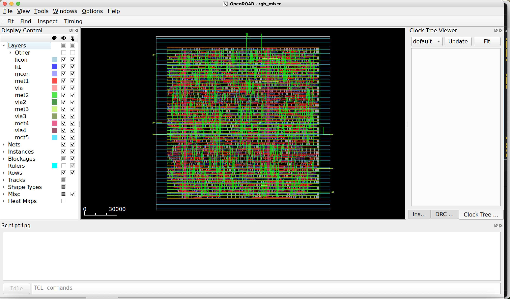

# RGB Mixer example on OpenROAD

## RGB mixer: Placement

- The main steps of the flow are the following: 
    - Synthesis (Using Yosys)
        - RTL to GateNetlist
    - Floorplan
        - Chip definition areas
        - PDN
    - Placement
        - Std-Cells placement on the chip
    - Clock Tree Synthesis (CTS)
        - Routing and buffering clock signals accross the chip
    - **`Routing `**
        - Routing all cells interconnections
    - Finishing
        - Generate the GDS, Extracting parasitics, DRC and LVS checking

## RGB mixer: Flow scripts

### `rgb_mixer_sky130hd.sdc` script
```tcl
create_clock -name core_clock -period 2.5 [get_ports clk]
set_all_input_output_delays
``` 

- This scripts specifies design constraints of the design such as: 
    - Timing constraints (clocks)
    - Multicycle constraints
    - Flase paths
    - power constraints
    - ecc.

### SDC files {.alert}
Making an `SDC` file for your design might depend on the requirments but also the characteristics of your design. A nice summary of other `SDC` options can be found in [https://medium.com/@medhakadam21/synopsys-design-constraints-5784aa736c9e](https://medium.com/@medhakadam21/synopsys-design-constraints-5784aa736c9e)

---

### `rgb_mixer_sky130hd.tcl`
```tcl
# loading environment setup scripts
source "OpenROAD/helpers.tcl" 
source "OpenROAD/flow_helpers.tcl"
source "OpenROAD/sky130hd/sky130hd.vars.tcl"

# Setting up the design
set synth_verilog "../5.0.OpenSTA/synth/rgb_mixer_gl.v"
set design "rgb_mixer"
set top_module "rgb_mixer"
set sdc_file "scripts/rgb_mixer_sky130hd.sdc"
set die_area {0.0 0.0 160.0 160.0}
set core_area {10.0 10.0 150.0 150.0}

set slew_margin 20
set cap_margin 20

set global_place_density 0.9

# Runs the execution flow
include "scripts/flow.tcl"
```

- This script establishes the designd details (e.g., verilog files, sdc files, die area, core area)
- Modify this file according to your design.

---

### `flow.tcl`

- This script contains the sequence of OpenROAD commands used during the CTS stage. 

- The Following are the main CTS commands in OpenROAD

    - `read_libraries`
    - `read_db CTS.db`
    - `read_sdc CTS.sdc`
    - `set_global_routing_layer_adjustment`
    - `set_routing_layers`
    - `pin_access`
    - `global_route`
    - `repair_antennas`
    - `detailed_route`
    - `repair_antennas`
    - `check_antennas`


- Detailed list of OpenROAD commands: [https://openroad.readthedocs.io/en/latest/main/README2.html](https://openroad.readthedocs.io/en/latest/main/README2.html)

- The full script in this example is available in [./Tutorials/7.1.Placement/scripts/flow.tcl](./scripts/flow.tcl)

--- 

### `flow.tcl` 
```tcl
read_libraries
read_db ../7.2.CTS/results/${design}_${platform}-tcl.db 
read_sdc ../7.2.CTS/results/${design}_${platform}-tcl.sdc

set_thread_count [cpu_count]
# Temporarily disable sta's threading due to random failures
sta::set_thread_count 1

utl::metric "IFP::ord_version" [ord::openroad_git_describe]
# Note that sta::network_instance_count is not valid after tapcells are added.
utl::metric "IFP::instance_count" [sta::network_instance_count]

################################################################
# Global routing
set_wire_rc -signal -layer $wire_rc_layer
set_wire_rc -clock -layer $wire_rc_layer_clk
set_dont_use $dont_use

set_global_routing_layer_adjustment ${min_routing_layer}-${max_routing_layer} 0.2

set_routing_layers -clock ${min_routing_layer}-${max_routing_layer}
set_routing_layers -signal ${min_routing_layer}-${max_routing_layer}

pin_access

set route_guide [make_result_file ${design}_${platform}.route_guide]
global_route -guide_file $route_guide \
  -congestion_iterations 1000 -verbose

set verilog_file [make_result_file ${design}_${platform}.v]
write_verilog -remove_cells $filler_cells $verilog_file

################################################################
# Repair antennas post-GRT

utl::set_metrics_stage "grt__{}"
repair_antennas -iterations 5

check_antennas
utl::clear_metrics_stage
utl::metric "GRT::ANT::errors" [ant::antenna_violation_count]

################################################################
# Detailed routing

# Run pin access again after inserting diodes and moving cells

detailed_route -output_drc [make_result_file "${design}_${platform}_route_drc.rpt"] \
  -output_maze [make_result_file "${design}_${platform}_maze.log"] \
  -bottom_routing_layer $min_routing_layer \
  -top_routing_layer $max_routing_layer \
  -droute_end_iter 10 \
  -or_seed 42 \
  -verbose 1

write_guides [make_result_file "${design}_${platform}_output_guide.mod"]
set drv_count [detailed_route_num_drvs]
utl::metric "DRT::drv" $drv_count

set routed_db [make_result_file ${design}_${platform}_route.db]
write_db $routed_db

set routed_def [make_result_file ${design}_${platform}_route.def]
write_def $routed_def

################################################################
# Repair antennas post-DRT

set repair_antennas_iters 0
utl::set_metrics_stage "drt__repair_antennas__pre_repair__{}"
while { [check_antennas] && $repair_antennas_iters < 15 } {
  utl::set_metrics_stage "drt__repair_antennas__iter_${repair_antennas_iters}__{}"

  repair_antennas

  detailed_route -output_drc [make_result_file "${design}_${platform}_ant_fix_drc.rpt"] \
    -output_maze [make_result_file "${design}_${platform}_ant_fix_maze.log"] \
    -bottom_routing_layer $min_routing_layer \
    -top_routing_layer $max_routing_layer \
    -droute_end_iter 10 \
    -or_seed 42 \
    -verbose 1

  incr repair_antennas_iters
}

utl::set_metrics_stage "drt__{}"
check_antennas

utl::clear_metrics_stage
utl::metric "DRT::ANT::errors" [ant::antenna_violation_count]

if { ![design_is_routed] } {
  error "Design has unrouted nets."
}

set repair_antennas_db [make_result_file ${design}_${platform}_repaired_route.odb]
write_db $repair_antennas_db

################################################################
# Filler placement

filler_placement $filler_cells
check_placement -verbose

# checkpoint
set fill_db [make_result_file ${design}_${platform}_fill.db]
write_db $fill_db

################################################################
# Extraction

if { $rcx_rules_file != "" } {
  define_process_corner -ext_model_index 0 X
  extract_parasitics -ext_model_file $rcx_rules_file

  set spef_file [make_result_file ${design}_${platform}.spef]
  write_spef $spef_file

  read_spef $spef_file
} else {
  # Use global routing based parasitics inlieu of rc extraction
  estimate_parasitics -global_routing
}

################################################################
# Final Report

report_checks -path_delay min_max -format full_clock_expanded \
  -fields {input_pin slew capacitance} -digits 3
report_worst_slack -min -digits 3
report_worst_slack -max -digits 3
report_tns -digits 3
report_check_types -max_slew -max_capacitance -max_fanout -violators -digits 3
report_clock_skew -digits 3
report_power -corner $power_corner

report_floating_nets -verbose
report_design_area

utl::metric "DRT::worst_slack_min" [sta::worst_slack -min]
utl::metric "DRT::worst_slack_max" [sta::worst_slack -max]
utl::metric "DRT::tns_max" [sta::total_negative_slack -max]
utl::metric "DRT::clock_skew" [expr abs([sta::worst_clock_skew -setup])]

# slew/cap/fanout slack/limit
utl::metric "DRT::max_slew_slack" [expr [sta::max_slew_check_slack_limit] * 100]
utl::metric "DRT::max_fanout_slack" [expr [sta::max_fanout_check_slack_limit] * 100]
utl::metric "DRT::max_capacitance_slack" [expr [sta::max_capacitance_check_slack_limit] * 100]
# report clock period as a metric for updating limits
utl::metric "DRT::clock_period" [get_property [lindex [all_clocks] 0] period]

global_connect

set global_place_pad_db [make_result_file ${design}_${platform}.db]
write_db $global_place_pad_db

set routed_def [make_result_file ${design}_${platform}.def]
write_def $routed_def

set verilog_file [make_result_file ${design}_${platform}.v]
write_verilog $verilog_file

set verilog_file_pdn [make_result_file ${design}_${platform}_pdn.v]
write_verilog -include_pwr_gnd $verilog_file_pdn

set sdc_file [make_result_file ${design}_${platform}.sdc]
write_sdc  $sdc_file
```

## RGB mixer: Makefile

### OpenROAD Makefile
```Makefile
export RESULTS_DIR=$(PWD)/results

run: 
    @echo "Running floorplanning..."
    openroad scripts/rgb_mixer_sky130hd.tcl

clean:
    @echo "Cleaning up floorplanning results..."
    rm -rf results *.log
```

### Executing the Floorplan step
```bash
make clean run
```

### Open the GUI view
```bash
openroad> gui::show
```

---

## RGB mixer Placement result
<div style="text-align: center;">
    
</div>

---

## OpenROAD saving files

- After executing the floorplan flow, the tool automatically stores temporary files used in the subsequent steps. 

### Generated files
```bash
|-- results
|   |-- rgb_mixer_sky130hd_pdn-tcl.v # Verilog netlist with PWR pins
|   |-- rgb_mixer_sky130hd-tcl.db # OpenROAD database
|   |-- rgb_mixer_sky130hd-tcl.def # layout file
|   |-- rgb_mixer_sky130hd-tcl.sdc # SDC file # 
|   |-- rgb_mixer_sky130hd-tcl.v # Verilog netlist
```
