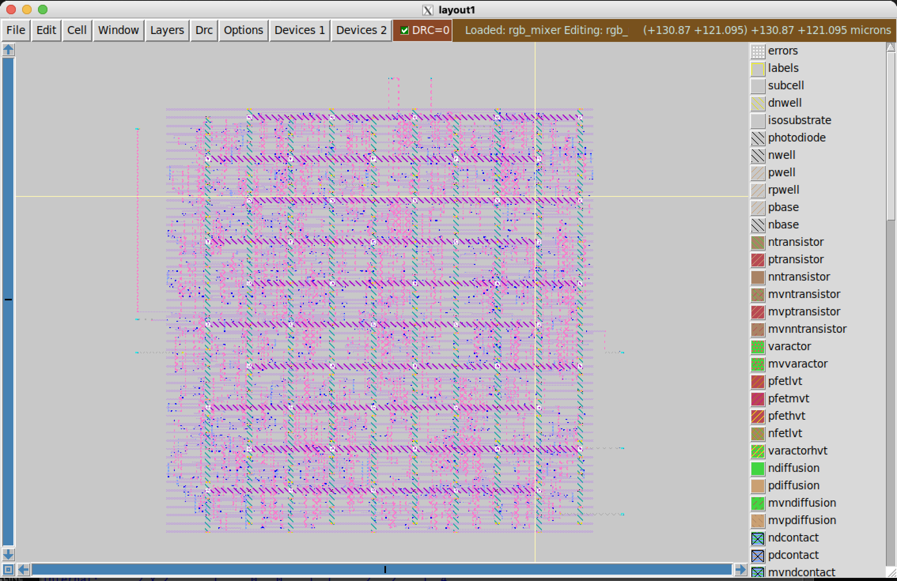
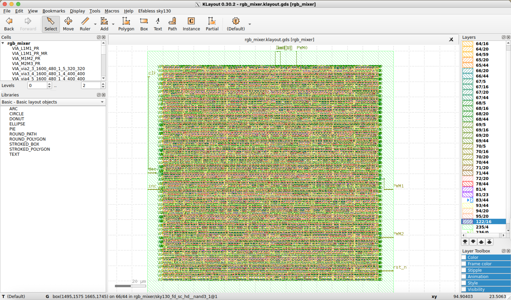

# Design Rule Checking (DRC) & Layout Versus Schematic (LVS)

## DRC & LVS 

- The last stept in the Physical Design flow is DRC and LVS. 
- These steps aim to ensure the chip is manufacturable.
- The DRC verifies that the final layout fullfills the minimum requirements from the PDK.
- The LVS ensures that the layout has the same behaviour as the verilog netlist.
- One last step involves the STA analysis using the Placed and Routed netlist.

### Useful scripts
```bash
|-- scripts
|   |-- tcl_env_mgds.tcl # Environmental variables definition for Magic
|   |-- lvs_script.lvs # LVS script for Netgen during LVS analysis
|   |-- opensta.tcl # Static Timing Analysis using OpenSTA after PnR
```

---

### Makefile 
- The makefile automation enables to execute the generation ofthe `GDS` and the `DRC` analysis using `Magic` and `Klayout` tools. 
- In addition the `LVS` uses `Magic` and `netgen`. The former generates the `spice` model of the design and the second tool checks whether the layout design matches the verilog netlist. 

- The Makefile initializes ans export different environmental variables needed across all the tools in the flow.

- The full Makefile is available in [./Tutorials/7.4.DRC-LVS/Makefile](./Makefile).

```Makefile
DESIGN_NAME=rgb_mixer

SRC_DIR=../7.3.Routing/results/
TOOL_SCRIPTS=/usr/local/lib/python3.12/dist-packages/librelane/scripts
TOOL_STEP_DIR=$(PWD)/results

export SCRIPTS_DIR=$(TOOL_SCRIPTS)
export STEP_DIR=$(TOOL_STEP_DIR)
export NETGEN_SETUP=/foss/pdks/sky130A/libs.tech/netgen/sky130A_setup.tcl


MAGIC_GDS_ENV=scripts/tcl_env_mgds.tcl
MAGIC_GDS_SCRIPT=$(TOOL_SCRIPTS)/magic/def/mag_gds.tcl

MAGIC_DRC_ENV=scripts/tcl_env_mgds.tcl
MAGIC_DRC_SCRIPT=$(TOOL_SCRIPTS)/magic/drc.tcl

MAGIC_LVS_ENV=scripts/tcl_env_lvs.tcl
MAGIC_LVS_SCRIPT=$(TOOL_SCRIPTS)/magic/extract_spice.tcl

all: mgds mdrc kgds kdrc lvs

res: 
	cp -r $(SRC_DIR)/ .
	mkdir -p results/reports

mgds: res
	@echo "Starting Magic DRC and LVS..."
	export _TCL_ENV_IN=$(MAGIC_GDS_ENV); export _MAGIC_SCRIPT=$(MAGIC_GDS_SCRIPT); exec magic -dnull -noconsole \
	-rcfile /foss/pdks/sky130A/libs.tech/magic/sky130A.magicrc \
	$(TOOL_SCRIPTS)/magic/wrapper.tcl

mdrc: mgds
	@echo "Starting Magic DRC and LVS..."
	export _TCL_ENV_IN=$(MAGIC_DRC_ENV); export _MAGIC_SCRIPT=$(MAGIC_DRC_SCRIPT); exec magic -dnull -noconsole \
	-rcfile /foss/pdks/sky130A/libs.tech/magic/sky130A.magicrc \
	$(TOOL_SCRIPTS)/magic/wrapper.tcl

kgds: res
	/usr/bin/python3 $(TOOL_SCRIPTS)/klayout/stream_out.py \
	results/rgb_mixer_sky130hd-tcl.def \
	--output results/rgb_mixer.klayout.gds \
	--top $(DESIGN_NAME) \
	--lyp /foss/pdks/sky130A/libs.tech/klayout/tech/sky130A.lyp \
	--lyt /foss/pdks/sky130A/libs.tech/klayout/tech/sky130A.lyt \
	--lym /foss/pdks/sky130A/libs.tech/klayout/tech/sky130A.map \
	--input-lef /foss/pdks/sky130A/libs.ref/sky130_fd_sc_hd/techlef/sky130_fd_sc_hd__nom.tlef \
	--input-lef /foss/pdks/sky130A/libs.ref/sky130_fd_sc_hd/lef/sky130_fd_sc_hd.lef \
	--input-lef /foss/pdks/sky130A/libs.ref/sky130_fd_sc_hd/lef/sky130_ef_sc_hd.lef \
	--with-gds-file /foss/pdks/sky130A/libs.ref/sky130_fd_sc_hd/gds/sky130_fd_sc_hd.gds

kdrc: kgds
	klayout -b -zz -r /foss/pdks/sky130A/libs.tech/klayout/drc/sky130A_mr.drc \
	-rd input=results/rgb_mixer.klayout.gds \
	-rd topcell=$(DESIGN_NAME) \
	-rd report=reports/drc_violations.klayout.xml \
	-rd feol=true -rd beol=true -rd floating_metal=false -rd offgrid=true -rd seal=true -rd threads=12

	python3 $(TOOL_SCRIPTS)/klayout/xml_drc_report_to_json.py \
	--xml-file=results/reports/drc_violations.klayout.xml \
	--json-file=results/reports/drc_violations.klayout.json

lvs: mgds
	export _TCL_ENV_IN=$(MAGIC_LVS_ENV); export _MAGIC_SCRIPT=$(MAGIC_LVS_SCRIPT); magic -dnull -noconsole \
	-rcfile /foss/pdks/sky130A/libs.tech/magic/sky130A.magicrc \
	$(TOOL_SCRIPTS)/magic/wrapper.tcl

	netgen -batch source scripts/lvs_script.lvs

sta: res
	sta scripts/opensta.tcl

clean:
	@echo "Cleaning up DRC and LVS results..."
	rm -rf results *.log *.rpt
```


### 

# GDS

## Magic

- The `Magic` scripts for `GDS` and `DRC` require some environmental variables given by `tcl_env_mgds.tcl` script. This script is passed as an environmental variable named `_ENV_TCL_IN`.

- The full `tcl_env_mgds.tcl` script is available in [./Tutotials/7.4.DRC-LVS/scripts/tcl_env_mgds.tcl](./scripts/tcl_env_mgds.tcl)

### tcl_env_mgds.tcl
```tcl
set ::env(DESIGN_NAME) rgb_mixer
set ::env(TECH_LEF) /foss/pdks/sky130A/libs.ref/sky130_fd_sc_hd/techlef/sky130_fd_sc_hd__nom.tlef
set ::env(TECH_LEFS) "\"nom_*\" /foss/pdks/sky130A/libs.ref/sky130_fd_sc_hd/techlef/sky130_fd_sc_hd__nom.tlef .."
set ::env(CELL_GDS) /foss/pdks/sky130A/libs.ref/sky130_fd_sc_hd/gds/sky130_fd_sc_hd.gds
set ::env(CELL_LEFS) "/foss/pdks/sky130A/libs.ref/sky130_fd_sc_hd/lef/sky130_fd_sc_hd.lef ..."
set ::env(MAGIC_DEF_LABELS) 1
set ::env(MAGIC_GDS_POLYGON_SUBCELLS) 0
set ::env(MAGIC_DEF_NO_BLOCKAGES) 1
set ::env(MAGIC_INCLUDE_GDS_POINTERS) 0
set ::env(MAGICRC) /foss/pdks/sky130A/libs.tech/magic/sky130A.magicrc
set ::env(MAGIC_TECH) /foss/pdks/sky130A/libs.tech/magic/sky130A.tech
set ::env(MAGIC_PDK_SETUP) /foss/pdks/sky130A/libs.tech/magic/sky130A.tcl
set ::env(CELL_MAGS) "/foss/pdks/sky130A/libs.ref/sky130_fd_sc_hd/mag/sky130_ef_sc_hd__decap_12.mag ..."
set ::env(CELL_MAGLEFS) "/foss/pdks/sky130A/libs.ref/sky130_fd_sc_hd/maglef/sky130_ef_sc_hd__decap_12.mag ..."
set ::env(MAGIC_CAPTURE_ERRORS) 1
set ::env(MAGIC_ZEROIZE_ORIGIN) 0
set ::env(MAGIC_EXT_USE_GDS) 0
set ::env(MAGIC_NO_EXT_UNIQUE) 0
set ::env(MAGIC_EXT_SHORT_RESISTOR) 0
set ::env(MAGIC_EXT_ABSTRACT) 0
set ::env(MAGIC_FEEDBACK_CONVERSION_THRESHOLD) 10000
set ::env(MAGIC_DISABLE_CIF_INFO) 1
set ::env(MAGIC_MACRO_STD_CELL_SOURCE) macro
set ::env(CURRENT_DEF) results/rgb_mixer_sky130hd-tcl.def
set ::env(SAVE_GDS) results/rgb_mixer.gds
set ::env(SAVE_MAG_GDS) results/rgb_mixer.magic.gds
set ::env(MAGIC_DRC_USE_GDS) 1
set ::env(CURRENT_GDS) results/rgb_mixer.magic.gds
set ::env(SAVE_MAG) results/rgb_mixer.mag
set ::env(SAVE_SPICE) results/rgb_mixer.spice
set ::env(MACRO_GDS_FILES) ""
set ::env(DIE_AREA) "0.0 0.0 160.0 160.0"
set ::env(MAGTYPE) mag
```

---

### GDS Generation

- The makefile implements the `mgds` target for generating the `GDS` file using Magic. 

```makefile
res: 
	cp -r $(SRC_DIR)/ .
	mkdir -p results/reports

mgds: res
	@echo "Starting Magic DRC and LVS..."
	export _TCL_ENV_IN=$(MAGIC_GDS_ENV); export _MAGIC_SCRIPT=$(MAGIC_GDS_SCRIPT); exec magic -dnull -noconsole \
	-rcfile /foss/pdks/sky130A/libs.tech/magic/sky130A.magicrc \
	$(TOOL_SCRIPTS)/magic/wrapper.tcl
```

- Use make to generate the `GDS`

```bash
make clean mgds
```

---

### GDS in Magic

- This is the `GDS` view for the RGB mixer in Magic.

<div style="text-align: center;">
    
</div>


## Klayout

- The makefile also implements the `kgds` target for generating the `GDS` file using `Klayout`. 

```makefile
res: 
	cp -r $(SRC_DIR)/ .
	mkdir -p results/reports

kgds: res
	/usr/bin/python3 $(TOOL_SCRIPTS)/klayout/stream_out.py \
	results/rgb_mixer_sky130hd-tcl.def \
	--output results/rgb_mixer.klayout.gds \
	--top $(DESIGN_NAME) \
	--lyp /foss/pdks/sky130A/libs.tech/klayout/tech/sky130A.lyp \
	--lyt /foss/pdks/sky130A/libs.tech/klayout/tech/sky130A.lyt \
	--lym /foss/pdks/sky130A/libs.tech/klayout/tech/sky130A.map \
	--input-lef /foss/pdks/sky130A/libs.ref/sky130_fd_sc_hd/techlef/sky130_fd_sc_hd__nom.tlef \
	--input-lef /foss/pdks/sky130A/libs.ref/sky130_fd_sc_hd/lef/sky130_fd_sc_hd.lef \
	--input-lef /foss/pdks/sky130A/libs.ref/sky130_fd_sc_hd/lef/sky130_ef_sc_hd.lef \
	--with-gds-file /foss/pdks/sky130A/libs.ref/sky130_fd_sc_hd/gds/sky130_fd_sc_hd.gds
```

- Use make to generate the `GDS`

```bash
make clean kgds
```

---

### GDS in Klayout

- This is the `GDS` view for the RGB mixer in `Klayout`.

<div style="text-align: center;">
    
</div>

# DRC

- The GDS is not ready to be manufactured unless it passes two verification steps. 

    - `DRC`: Checks that the generated `GDS` layout meets the minimum constraints established my the manufacturer or `PDK`.
    - `LVS`: Checks that the `GDS`actually behaves as the verilog netlist.

## DRC in Magic

- The target in the Makefile for running `DRC`check using `Magic`.

```Makefile
mdrc: mgds
	@echo "Starting Magic DRC and LVS..."
	export _TCL_ENV_IN=$(MAGIC_DRC_ENV); export _MAGIC_SCRIPT=$(MAGIC_DRC_SCRIPT); exec magic -dnull -noconsole \
	-rcfile /foss/pdks/sky130A/libs.tech/magic/sky130A.magicrc \
	$(TOOL_SCRIPTS)/magic/wrapper.tcl
```

- The following command executes the `DRC`

```bash
make mdrc
```

- At the end of the `DRC` run, a report file is generated in [./Tutotials/7.4.DRC-LVS/results/reports/drc_violations.magic.rpt](./results/reports/drc_violations.magic.rpt) 

- The `drc_violations.magic.rpt` report should indicate **0** violations, otherwise the design cannot be manufactured. 

```txt
rgb_mixer
----------------------------------------
[INFO] COUNT: 0
[INFO] Should be divided by 3 or 4
```

## DRC in Klayout

- The Makefile target for running `DRC` on `Klayout`

```Makefile
kdrc: kgds
	klayout -b -zz -r /foss/pdks/sky130A/libs.tech/klayout/drc/sky130A_mr.drc \
	-rd input=results/rgb_mixer.klayout.gds \
	-rd topcell=$(DESIGN_NAME) \
	-rd report=reports/drc_violations.klayout.xml \
	-rd feol=true -rd beol=true -rd floating_metal=false -rd offgrid=true -rd seal=true -rd threads=12

	python3 $(TOOL_SCRIPTS)/klayout/xml_drc_report_to_json.py \
	--xml-file=results/reports/drc_violations.klayout.xml \
	--json-file=results/reports/drc_violations.klayout.json
```

- The following command executes the `DRC`

```bash
make kdrc
```

- The final report will be available under [./Tutotials/7.4.DRC-LVS/results/reports/drc_violations.klayout.json](./results/reports/drc_violations.klayout.json)

---

- The total number of erros at the end of the file must be **0**.

```json
{
   ...
    "hvntm_OFFGRID": 0,
    "hvntm_angle": 0,
    "vhvi_OFFGRID": 0,
    "vhvi_angle": 0,
    "uhvi_OFFGRID": 0,
    "uhvi_angle": 0,
    "pwell_rs_OFFGRID": 0,
    "pwell_rs_angle": 0,
    "areaid_re_OFFGRID": 0,
    "total": 0
}
```

# LVS

- `LVS` uses `Magic`and `Netget` for checking the functionality of the GDS. 

- The Makefile target for `LVS` is the following:

```Makefile
lvs: mgds
	export _TCL_ENV_IN=$(MAGIC_LVS_ENV); export _MAGIC_SCRIPT=$(MAGIC_LVS_SCRIPT); magic -dnull -noconsole \
	-rcfile /foss/pdks/sky130A/libs.tech/magic/sky130A.magicrc \
	$(TOOL_SCRIPTS)/magic/wrapper.tcl

	netgen -batch source scripts/lvs_script.lvs
```

- The `Netgen` script `lvs_script.lvs` defines the circuits to be compared both a verilog and a `spice`.
```tcl
set circuit1 [readnet spice results/rgb_mixer.spice]
set circuit2 [readnet verilog /dev/null]
puts "Reading SPICE netlist file '/foss/pdks/sky130A/libs.ref/sky130_fd_sc_hd/spice/sky130_ef_sc_hd__decap_12.spice'..."
readnet spice /foss/pdks/sky130A/libs.ref/sky130_fd_sc_hd/spice/sky130_ef_sc_hd__decap_12.spice $circuit2
puts "Reading SPICE netlist file '/foss/pdks/sky130A/libs.ref/sky130_fd_sc_hd/spice/sky130_ef_sc_hd__decap_20_12.spice'..."
readnet spice /foss/pdks/sky130A/libs.ref/sky130_fd_sc_hd/spice/sky130_ef_sc_hd__decap_20_12.spice $circuit2
puts "Reading SPICE netlist file '/foss/pdks/sky130A/libs.ref/sky130_fd_sc_hd/spice/sky130_ef_sc_hd__decap_40_12.spice'..."
readnet spice /foss/pdks/sky130A/libs.ref/sky130_fd_sc_hd/spice/sky130_ef_sc_hd__decap_40_12.spice $circuit2
puts "Reading SPICE netlist file '/foss/pdks/sky130A/libs.ref/sky130_fd_sc_hd/spice/sky130_ef_sc_hd__decap_60_12.spice'..."
readnet spice /foss/pdks/sky130A/libs.ref/sky130_fd_sc_hd/spice/sky130_ef_sc_hd__decap_60_12.spice $circuit2
puts "Reading SPICE netlist file '/foss/pdks/sky130A/libs.ref/sky130_fd_sc_hd/spice/sky130_ef_sc_hd__decap_80_12.spice'..."
readnet spice /foss/pdks/sky130A/libs.ref/sky130_fd_sc_hd/spice/sky130_ef_sc_hd__decap_80_12.spice $circuit2
puts "Reading SPICE netlist file '/foss/pdks/sky130A/libs.ref/sky130_fd_sc_hd/spice/sky130_ef_sc_hd__fill_12.spice'..."
readnet spice /foss/pdks/sky130A/libs.ref/sky130_fd_sc_hd/spice/sky130_ef_sc_hd__fill_12.spice $circuit2
puts "Reading SPICE netlist file '/foss/pdks/sky130A/libs.ref/sky130_fd_sc_hd/spice/sky130_ef_sc_hd__fill_2.spice'..."
readnet spice /foss/pdks/sky130A/libs.ref/sky130_fd_sc_hd/spice/sky130_ef_sc_hd__fill_2.spice $circuit2
puts "Reading SPICE netlist file '/foss/pdks/sky130A/libs.ref/sky130_fd_sc_hd/spice/sky130_ef_sc_hd__fill_4.spice'..."
readnet spice /foss/pdks/sky130A/libs.ref/sky130_fd_sc_hd/spice/sky130_ef_sc_hd__fill_4.spice $circuit2
puts "Reading SPICE netlist file '/foss/pdks/sky130A/libs.ref/sky130_fd_sc_hd/spice/sky130_ef_sc_hd__fill_8.spice'..."
readnet spice /foss/pdks/sky130A/libs.ref/sky130_fd_sc_hd/spice/sky130_ef_sc_hd__fill_8.spice $circuit2
puts "Reading SPICE netlist file '/foss/pdks/sky130A/libs.ref/sky130_fd_sc_hd/spice/sky130_fd_sc_hd.spice'..."
readnet spice /foss/pdks/sky130A/libs.ref/sky130_fd_sc_hd/spice/sky130_fd_sc_hd.spice $circuit2
readnet verilog results/rgb_mixer_sky130hd_pdn-tcl.v $circuit2
lvs "$circuit1 rgb_mixer" "$circuit2 rgb_mixer" /usr/local/lib/python3.12/dist-packages/librelane/scripts/netgen/setup.tcl results/reports/lvs.netgen.rpt -blackbox -json
```

---

- The following command executes the `LVS`

```bash
make lvs
```

- The final report will be available under [./Tutotials/7.4.DRC-LVS/results/reports/lvs.netgen.rpt](./results/reports/lvs.netgen.rpt)

- The report must indicate that `The circuits Match Uniquely`. 

```txt
Netlists match uniquely.

Subcircuit pins:
Circuit 1: rgb_mixer                       |Circuit 2: rgb_mixer                       
-------------------------------------------|-------------------------------------------
inc                                        |inc                                        
PWM1                                       |PWM1                                       
PWM0                                       |PWM0                                       
PWM2                                       |PWM2                                       
dec                                        |dec                                        
led[0]                                     |led[0]                                     
led[1]                                     |led[1]                                     
rst_n                                      |rst_n                                      
clk                                        |clk                                        
---------------------------------------------------------------------------------------
Cell pin lists are equivalent.
Device classes rgb_mixer and rgb_mixer are equivalent.

Final result: Circuits match uniquely.
```

# STA PnR

## OpenSTA script

- The full script is available in [./Tutotials/7.4.DRC-LVS/scripts/opensta.tcl](./scripts/opensta.tcl)

```tcl
# Read library files
set PDK_ROOT $env(PDK_ROOT)
set PDK $env(PDK)

set lib_dir ${PDK_ROOT}/${PDK}/libs.ref/sky130_fd_sc_hd
read_liberty ${lib_dir}/lib/sky130_fd_sc_hd__tt_025C_1v80.lib

# Load netlist
read_verilog "./results/rgb_mixer_sky130hd-tcl.v"
link_design rgb_mixer

source "./results/rgb_mixer_sky130hd-tcl.sdc"

report_checks -sort_by_slack -path_delay max -fields {slew cap input net fanout} -format full_clock_expanded -group_path_count 1000 > "./max_sta.rpt"
report_checks -sort_by_slack -path_delay min -fields {slew cap input net fanout} -format full_clock_expanded -group_path_count 1000 > "./min_sta.rpt"
report_checks -unconstrained -fields {slew cap input net fanout} -format full_clock_expanded > "./unc_sta.rpt"
report_checks -slack_max -0.01 -fields {slew cap input net fanout} -format full_clock_expanded > "./slack_sta.rpt"
report_check_types -max_slew -max_capacitance -max_fanout -violators > "./vio_sta.rpt"
report_parasitic_annotation -report_unannotated > "./para_sta.rpt"
check_setup -verbose -unconstrained_endpoints -multiple_clock -no_clock -no_input_delay -loops -generated_clocks > "./setup_sta.rpt"
exit
```

---

### STA Makefile target

- The Makefile runs opensta with the specified script

```Makefile
sta: res
	sta scripts/opensta.tcl
```

- Running the STA using the following command

```bash
make sta
```
- The STA is generated as several `*.rpt` files in [./Tutorials/7.4.DRC-LVS](./)

```bash
|-- max_sta.rpt # Max path delay report
|-- mix_sta.rpt # Min path delay report
|-- para_sta.rpt # Parasitic annotation report
|-- setup_sta.rpt # Setup timing report
|-- slack_sta.rpt # Slack timing report
|-- unc_sta.rpt # Uncostrained paths report
|-- vio_sta.rpt # Timing violation report
```

### Note {.alert}

Timing violations are reported in `vio_sta.rpt`, this report indicates any timing issue that limits the desired performance. 
